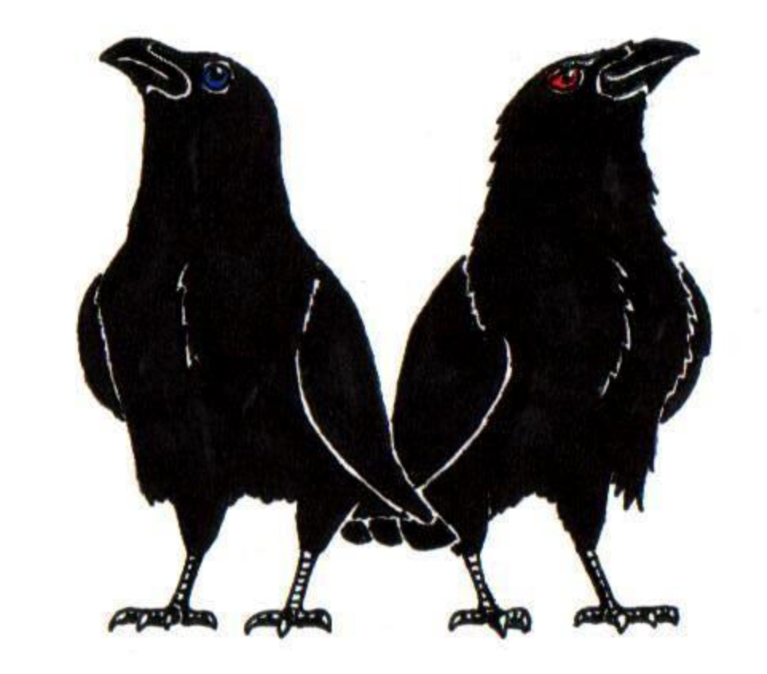

= Munin

This repository holds engineering artifacts associated with the Munin project.

== Protocol Verifier

https://en.wikipedia.org/wiki/Huginn_and_Muninn[Munin] is the nickname for
an application called 'Protocol Verifier' (PV).

Fundamentally, the Protocol Verifier observes and confirms that a job running
on a system under observation does what it was defined to do.  On the flip side,
the Protocol Verifier detects when a job running on a system under observation
violates the protocol prescribed for it.

The PV verifies that units of work (jobs) running within a system are
doing what they were designed to do and neither more nor less.  "Are you
doing what you said you are doing?"

The Protocol Verifier reports each job as finishing with status 'success',
'fail' or 'alarm'.

== References

https://github.com/xtuml/munin/blob/main/doc/notes/ProtocolVerifierCapabilities.adoc[Protocol
Verifier Capabilities] defines fundamental terms and gives a brief
overview of what the PV can do.

https://github.com/xtuml/plus2json/blob/main/doc/tutorial/AuditEventTopologyTutorial.pdf[Audit
Event Tutorial] is an instructive slide presentation explaining the various
means of observation and constraint application.

https://www.youtube.com/watch?v=UjR9AR8M2Ew[Munin Protocol Verifier] is a
27 minute youtube video that was presented at the
https://xtuml.github.io/xday/smdays2023.html[2023 Shlaer-Mellor Day]
conference.

https://github.com/xtuml/munin/blob/main/doc/howto/HOWTO_Munin.adoc[HOWTO
Munin] explains how to build and run the Protocol Verifier.

== Access and Getting Involved

The Protocol Verifier and associated utilities are Open Source Software.
You are welcome to fork, clone, raise issues and join in the
collaboration.

