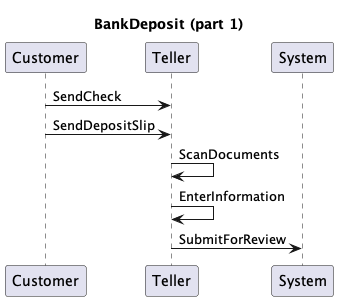
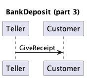
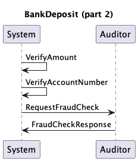
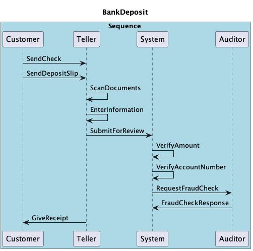
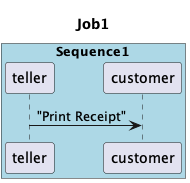
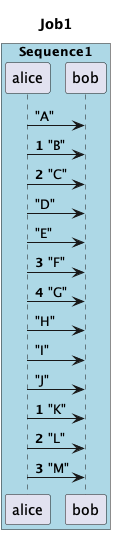
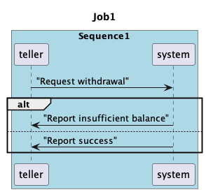
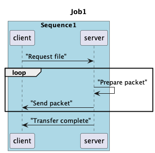
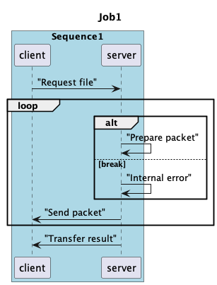

= PLUS User Guide

== Introduction

The Munin protocol verifier is dynamically configured using UML sequence
diagrams as input for defining valid sequences of events. A subset of the
PlantUML syntax forms a DSL for defining these sequences and PlantUML can be
used as a visualization tool.

== Specification

=== General Parsing Rules

The PLUS processor operates on a line by line basis. Each statement must be
fully contained on a single line. Blank lines are ignored.

Each line is split into tokens by whitespace. Extra whitespace characters are
ignored. Element names may not have spaces in them unless they are wrapped by
double quotes (`""`).

Display directives prepended with hash (`#`) or found inside square brackets
(`[]`) are ignored.

PLUS does not directly support code comments, however any line that does not
match one of the supported statements is silently ignored. PlantUML single line
comments (start with a single `'`) will work. PlantUML block comments
(surrounded by `/' ... '/`) will work as long as no valid statements are
contained in the block.

=== File Structure and Preprocessing

PLUS job definitions are defined in files with the `.puml` extension. Each
definition file must contain at least one UML block. The start of a UML block is
denoted by the `@startuml` statement on a line by itself and the end of the UML
block is denoted by the `@enduml` statement on a line by itself. There may be
more than one UML block defined in a single file. Optionally, an identifier can
be associated with a UML block:

----
@startuml
...
@enduml

@startuml(id=block2)
...
@enduml

@startuml(id=block3)
...
@enduml
----

When a job definition file is processed, the first UML block is taken to be the
definition of the top level block, and subsequent UML blocks are skipped. In
typical usage, a job definition file will either contain one default UML block
(top level job definition file) or one to many labeled UML blocks intended to be
`!include` -ed elsewhere.

PLUS supports the `!include` PlantUML statement during a preprocessor step using
the following syntax:

----
!include <filepath>!<block_identifier>
----

`<filepath>` is a valid relative filesystem path which refers to the `.puml`
file where the target UML block is defined. The path is relative to the location
of the original source file being processed. By convention, definition files
should start with an underscore (`_`) if they are not intended to be processed
as a top level job definition.

Includes are handled during preprocessing and simply inject the statements from
the target UML block in the place of the `!include` statement itself.

Example:

._BankDeposit1.puml
----
@startuml(id=Part1)
title BankDeposit (part 1)
participant Customer
participant Teller
participant System
Customer -> Teller : SendCheck
Customer -> Teller : SendDepositSlip
Teller -> Teller : ScanDocuments
Teller -> Teller : EnterInformation
Teller -> System : SubmitForReview
@enduml

@startuml(id=Part3)
title BankDeposit (part 3)
participant Teller
participant Customer
Teller -> Customer : GiveReceipt
@enduml
----

._BankDeposit2.puml
----
@startuml(id=Part2)
title BankDeposit (part 2)
participant System
participant Auditor
System -> System : VerifyAmount
System -> System : VerifyAccountNumber
System -> Auditor : RequestFraudCheck
Auditor -> System: FraudCheckResponse
@enduml
----

.BankDeposit.puml
----
@startuml
box Sequence #LightBlue

# note the included files begin with "_"
!include _BankDeposit1.puml!Part1
!include _BankDeposit2.puml!Part2
!include _BankDeposit1.puml!Part3

# participants restated here to control display order
participant Customer
participant Teller
participant System
participant Auditor
end box

# title restated at the end to ensure it is the last title statement
title BankDeposit
@enduml
----

=== Statements

==== Job Name

The job name is defined by the `title` statement. Every top level job definition
_must_ have a name defined. If multiple `title` statements are encountered, the
last one wins:

----
title MyJob
title "My Job With Spaces"
----

If a job definition is composed of many `!include` statements, the `title`
statement should come _after_ the `!includes` to assure it is the last `title`
statement processed for the job definition:

==== Start/End Sequence Definition

A job consists of one or more disjoint sequences of events. A sequence is
defined by surrounding a set of statements with a `box` definition. All audit
event statements and participant declarations must be defined within a sequence:

----
box Sequence1 #LightBlue
...
end box
----

==== Application/Participant

All participants in the sequence must be pre-declared. This is done with the
`participant` statement:

----
participant Participant1
participant Participant2
participant "Participant with Spaces"
----

==== Sequence Start/End

Sequences can have multiple valid starting and ending points. The first event in
a sequence is automatically considered to be a sequence start event. Likewise,
the last event in a sequence is automatically considered to be a sequence end
event. Other start and end events can be defined by sending messages between an
external "actor" and "participant" in the sequence diagram. An actor is defined
with the `actor` statement:

----
actor User
actor System
actor "Actor with Spaces"
----

Like participants, actors must be pre-declared. Actors must be declared
_outside_ the sequence definitions.

==== Audit Event

Actual audit events in sequences are defined using the message statement. The
message must be defined between a pre-declared actor or participant and another
participant in the diagram. The name of the message is the event name and
uniquely identifies the event type in the job. An additional occurrence number
is used in some cases to identify the instance of the event in the job
definition:

----
teller -> customer: "Print Receipt"
----

==== Start/Stop/Resume Numbering

In cases where an event or set of events is used in multiple places in a single
job definition, it is necessary to include an additional numeric value to
identify the occurrence of an event in a job sequence. Numbering can be
controlled by the following statements:

`autonumber` causes the processor to start automatically attaching occurrence
numbers to audit events with sequentially increasing integers starting at 1.

`autonumber stop` causes the processor to stop attaching occurrence numbers to
audit events. `autonumber stop` is not valid before an instance of `autonumber`
or `autonumber resume`.

`autonumber resume` causes the processor to restart attaching occurrence numbers
starting at the last number plus 1. `autonumber resume` is not valid before an
instance of `autonumber stop`

----
alice -> bob: "A"
autonumber
alice -> bob: "B"
alice -> bob: "C"
autonumber stop
alice -> bob: "D"
alice -> bob: "E"
autonumber resume
alice -> bob: "F"
alice -> bob: "G"
autonumber stop
alice -> bob: "H"
alice -> bob: "I"
alice -> bob: "J"
autonumber
alice -> bob: "K"
alice -> bob: "L"
alice -> bob: "M"
----

==== Alt/Else (in development)

Valid sequence definitions can branch into multiple distinct paths. This can be
specified using the `alt` and `else` groupings.

----
teller -> system: "Request withdrawal"
alt
system -> teller: "Report insufficient balance"
else
system -> teller: "Report success"
end alt
----

Each alt/else collection starts with a single `alt` statement followed by a
series of statements. An `else` statement can follow along with additional
statements. The whole collection is terminated by an `end` statement. There may
be any number of `else` branches. An `else` or `end` statement is invalid
without a preceding `alt` statement. Every `alt` statement must be terminated
with an `end` statement.

==== Loop (in development)

Valid sequences may have subsequences of events that occur repeatedly in a loop.
This can be  specified using the `loop` grouping.

----
client -> server: "Request file"
loop
server -> server: "Prepare packet"
server -> client: "Send packet"
end loop
server -> client: "Transfer complete"
----

===== Breaking from a loop (in development)

A loop can be constrained to a specific number of iterations or it can be
unconstrained. The sequence can also specify an event which breaks the loop
early. This is done by adding the word "break" as the secondary group label of
the branch of an `alt`:

----
client -> server: "Request file"
loop
alt
server -> server: "Prepare packet"
else break
server -> server: "Internal error"
end alt
server -> client: "Send packet"
end loop
server -> client: "Transfer result"
----

The last event an alt branch marked with "break" is considered to be a break
event. The next event expected after a "break" event is the first event after
the end of the loop. There is currently no support for breaking from the outer
loop of a nested loop.

