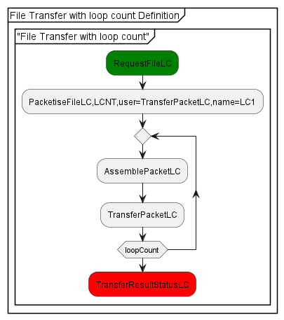
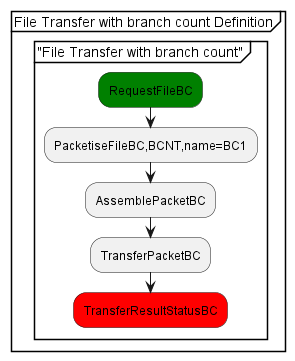

= PLUS and plus2json User Guide

== Introduction

The Munin Protocol Verifier is dynamically configured using the PLUS domain 
specific language. PLUS uses a constrained subset of PlantUML Activity
Diagrams as input for defining valid sequences of events and the
supplementary audit event data. PLUS is captured using textual input and the
PlantUML tools can be used for visualization and review.

The application plus2json converts the textual form of the PlantUML activity
diagrams into json files that are used to configure various aspects of the
Protocol Verifier and its associated tools.

== PLUS

=== Statements

==== Job Name

The job name is defined by the `partition` statement. Every job definition
_must_ have a name defined:

----
partition "MyJob" {
}
----

==== Start/End Sequence Definition

A job consists of one or more disjoint sequences of events. A sequence is
defined by surrounding a set of statements with a 'group' definition. All audit
event statements and participant declarations must be defined within a sequence:

----
group Sequence1
...
end group
----

==== Audit Event

Actual audit events in sequences are defined using the activity statement. The
name of the activity is the event name and uniquely identifies the event type.
An additional occurrence number is automatically generated so that if the same
event type occurs more than once in a Job definition it's location in the
sequence will be uniquely identified.

----
:transactionApproved;
----

==== Sequence of Audit Events

A sequence of audit events is captured by the sequential listing of activity statements.
The graphic shows the arrow representing the sequence automatically. These will always
occur in the context of a Sequence which is itself in a Job. A simple Job with a single
sequence of 3 audit events looks like this.

----
@startuml 
partition "Simple Job" {
  group "Fund Transfer"
    :requestFunds;
    :requestApproved;
    :fundsTransferred;
  end group
}
@enduml
----

==== Sequence Start/End

Sequences can have multiple valid starting and ending points. An event with no
predecessor event is deemed to be a sequence start event. An event with no 
successor event is deemed to be a sequence end event. An useful convention that
can help users to read and interpret the activity diagrams is to colour code the
start and end events using the #green and #red labels. These colour labels are ignored by the plus2json application and are an optional visual clue.

----
partition "MyJob" {
  group "Sequence1"
    #green:startEvent;
    :intermediaryEvent;
    #red:endEvent;
  end group
}
----

==== Alternate Paths through a Sequence

Valid sequence definitions can fork into alternate distinct paths. For example,
an error condition is tested with the sequence of events following the test where 
no error was detected would be different to the sequence of events where an error
was detected. In its basic form, this is achieved using the familiar 
if..then..else..endif construct. This captures a fork in the sequence of events. 
In this case it is an Exclusive-Or fork (XOR) since only one of the available paths 
can be taken for a given visit to the fork point.

----
@startuml
partition "File Transfer with XOR Definition" {
  group "File Transfer with XOR"
    #green:RequestFileX;
    :PacketiseFileX;
    if (XOR) then (normal)
      :AssemblePacketX;
    else (alternative)
      :ReportInvalidFileX;
    endif
    :TransferPacketX;
    #red:TransferResultStatusX;
  end group
}  
@enduml

----

Note that the terms in brackets associated with the if..then..else..endif 
(XOR, normal and alternate in this example) are
purely to enhance human readability. This information is not carried through
to the Protocol Verifier. Remember the role of the Protocol Verifier is to
verify that a sequence of events was expected. It does not need to know what 
the condition was that caused an alternative sequence of events to emerge just 
that an alternative sequence of events can be expected.

==== Additional End Events in a Sequence

Although the above is a valid construct it may not always be what is required 
after a fork. In this case it is unlikely that the system should continue
with the transfer if the alternate path is taken with the ReportInvalidFileX
event. In this case, the path may need to end at that point. This can be achieved 
using the 'detach' statement. Note that as the detach signals the end event of that
path we use the colour convention to mark the end event of a sequence. This shows
that sequences can have multiple end events.

----

@startuml
partition "File Transfer with XOR Definition" {
  group "File Transfer with XOR"
    #green:RequestFileX;
    :PacketiseFileX;
    if (XOR) then (normal)
      :AssemblePacketX;
    else (alternative)
      #red:ReportInvalidFileX;
      detach
    endif
    :TransferPacketX;
    #red:TransferResultStatusX;
  end group
}  
@enduml

----

==== Multiple Path Exclusive-OR Fork using elseif

An Exclusive-OR fork can have more than 2 branches and this can be supported
either by using if..then..elsif..elsif..else..endif.

----

@startuml
partition "File Transfer with XOR Definition" {
  group "File Transfer with XOR"
    #green:RequestFileX;
    :PacketiseFileX;
    if (XOR) then (simple)
      :AssemblePacketX;
    elseif (XOR) then (complex)
      :ReconstructPacketX;  
    else (alternative)
      :ReportInvalidFileX;
    endif
    :TransferPacketX;
    #red:TransferResultStatusX;
  end group
}  
@enduml

----

==== Multiple Path Exclusive-OR Fork using switch

If several alternates are required then a switch case construct is recommended:

----

@startuml
partition "File Transfer with XOR Definition" {
  group "File Transfer with XOR"
    #green:RequestFileX;
    :PacketiseFileX;
    switch (XOR)
      case (simple)
        :AssemblePacketX;
      case (complex)
        :ReconstructPacketX;  
      case (alternative)
        :ReportInvalidFileX;
    endswitch
    :TransferPacketX;
    #red:TransferResultStatusX;
  end group
}  
@enduml

----

==== Loop

Valid sequences may have subsequences of events that occur repeatedly in a loop.
This can be  specified using the `repeat`...`repeat while` construct. The following
is an example of an unconstrained loop. Consrtained loops with runtime specified
loop counts are also supported (see below).

----
@startuml
partition "File Transfer with loop Definition" {
  group "File Transfer with loop"
    #green:RequestFileL;
    :PacketiseFileL;
    repeat
      :AssemblePacketL;
      :TransferPacketL;
    repeat while (unconstrained)
    #red:TransferResultStatusL;
  end group
}  
@enduml
----

Note: Nested loops are currently not supported.

===== Breaking from a loop

The sequence can also specify an event which breaks the loop
early. This is done by adding the word "break" immediately
after the event that marks the break point in the loop. This
means the flow of control will exit the loop and continue 
with the first event after the end of the loop as shown:

----
@startuml
partition "File Transfer with loop break Definition" {
  group "File Transfer with loop break"
    #green:RequestFileB;
    :PacketiseFileB;
    repeat
      :AssemblePacketB;
      :TransferPacketB;
      if (XOR) then (break)
        :CorruptedPacketErrorB;
        break    
      else (normal)
      endif
    repeat while (loopCount)
    #red:TransferResultStatusB;
  end group
}  
@enduml
----

The event before the "break" is considered to be a break
event and is marked as such in the information sent to the
Protocol Verifier. The next event expected after a "break"
event is the first event after the end of the loop. 

=== Audit Event Data Definition

Audit events can be supplemented with audit event data that
allows additional verification checks to be performed. Each
of these is described here.

Audit event data is always attached to an event. The event that
provides the audit event data is known as the source event.
For some uses of audit event data other events will use or
check the audit event data event though they don't carry 
audit event data. In other cases other audit events will carry 
audit event data that has to be compared with the audit event data
on the source event. Both these latter cases are termed user events.

A given event can be the source of multiple elements of audit
event data.

==== Loop Counting

A runtime constraint can be added to a loop. This will specify
the number of times the events in the loop are expected to be
executed. The loop count is provided on the source audit event
which must occur somewhere before the loop and not be in a loop
of its own. The user event is defined as part of the audit event 
data and that defines the event that will be checked to see if
an event of the correct type has been seen the specified number 
of times.

----
@startuml
partition "File Transfer with loop count Definition" {
  group "File Transfer with loop count"
    #green:RequestFileLC;
    :PacketiseFileLC,LCNT,user=TransferPacketLC,name=LC1;
    repeat
      :AssemblePacketLC;
      :TransferPacketLC;
    repeat while (loopCount)
    #red:TransferResultStatusLC;
  end group
}  
@enduml
----

The audit event data defintion is added directly to the audit event.
The event PacketiseFileLC is the source event since that is the event
that is expected to carry the audit event data. Look the the elements 
of the PacketiseFileLC: the LCNT indicates that this audit event data 
is a loop count; user=TransferPacketLC indicates that the user event
i.e. the one that will be counted is TransferPacketLC which is an 
event within the loop; name=LC1 indicates that the name of the 
loop count is LC1 which will appear in the runtime audit event data
along with its value.

Any event within the loop can be used as the user event. The important
point is that the user event must be unambiguous when it appears on the
source event. For example, the source event could not be followed by
multiple paths where the same type of event as the user event occurs on
more than one path. It would be impossible for the system to resolve
which of the events to treat as the correct user event.

If an audit event is expected to carry a Loop Count and, at 
runtime, it doesn't then that is an error condition detected by
the Protocol Verifier.

Note: the phrase loopCount in the repeat while statement is only to
aid readability of the diagram. It is not passed to the
Protocol Verifier.

==== Branch Counting

A single audit event can be followed by mulitple instances of another 
type of audit event. This is likely to occur where the flow fragments
from large units into smaller unit. In the example shown here a single 
file is likely to result in many packets. So a single PacketiseFile
event might reasonably be followed by many AssemblePacket events.
This is known as an instance fork and at first sight it appears to
have no impact on the audit event definition since a PacketiseFile event
is followed by an AssemblePacket event in each case. However, this would
allow a large number of acceptable paths which is unlikely to be 
appropriate. So if instances forks are required then they must be 
accompanied by a branch count. This is a numeric value that says
how many instances of the event following the fork point to expect.
For example, the PacketiseFile event could carry audit event data
that indicates 12 packets were created from the file and so 12 
instances of the AssemblePacket event can be expected. This value
is determined and checked at runtime and so can be different for 
each execution of the Job.

A Branch Count source event must be prior to or at the fork point.
The user event of a Branch Count is the fork point, i.e. the single
event which expects multiple events to refer back to it in their
previous event id value. The source event and the user event can be 
the same event, i.e. the fork point. The source event can be earlier
than, and therefore separate to, the user event.

A Branch Count is mandatory for instance forks. If multiple occurrences
of the same type of event follow a single event without a branch
count being defined then the Protocol Verifier will record a failed Job.

A Branch Count could be used on an AND fork though it has significantly 
less value and is not mandatory.

----

@startuml
partition "File Transfer with branch count Definition" {
  group "File Transfer with branch count"
    #green:RequestFileBC;
    :PacketiseFileBC,BCNT,name=BC1;
    :AssemblePacketBC;
    :TransferPacketBC;
    #red:TransferResultStatusBC;
  end group
}  
@enduml

----

The audit event data defintion is added directly to the audit event.
The event PacketiseFileBC is the source event since that is the event
that is expected to carry the audit event data. It is also the user 
event in case as no user event has been explicitly mentioned. 
Look the the elements of the PacketiseFileBC: the BCNT indicates that 
this audit event data is a branch count; name=BC1 indicates that the 
name of the branch count is BC1 which will appear in the runtime audit 
event data along with its value.

If the source and user events were separate then user=<userEventTypeName> 
would be expected after the BCNT, and before name=BC1.

If an audit event is expected to carry an Branch Count and, at 
runtime, it doesn't then that is an error condition detected by
the Protocol Verifier.

==== Intra Job Invariant

An Intra Job Invariant is a data value that is attached to an audit event
that is then checked to see that the same value is attached to one or more 
other audit events within the same Job. As an example, consider a Job Type 
which represents a process that manipulates a file. It may be useful to 
calculate a hash from the file at the start of the process and then check 
that the same hash can be generated at the end of the process. This would
help verify that the process had not corrupted the file in some way.

The support for intra job invariants provides an additional level of
verification over and above that which can be achieved by sequencing the
audit events.

The first audit event in a Job that provides an intra job invariant is 
the source event. Any number of other audit events can provide the
same intra job invariant and these are all user events. The Protocol 
Verifier checks that the all the values of the intra job invariant
within a single job match. If they don't then that is an error condition.
If an audit event is expected to carry an intra job invariant and, at 
runtime, it doesn't then that is an error condition detected by
the Protocol Verifier.

==== Extra Job Invariant

=== plus2json General Parsing Rules

TODO check that the following paragraphs are still correct/relevant

plus2json operates on a line by line basis. Each statement must be
fully contained on a single line. Blank lines are ignored.

Each line is split into tokens by whitespace. Extra whitespace characters are
ignored. Element names may not have spaces in them unless they are wrapped by
double quotes (`""`).

Display directives prepended with hash (`#`) or found inside square brackets
(`[]`) are ignored.

PLUS does not directly support code comments, however any line that does not
match one of the supported statements is silently ignored. PlantUML single line
comments (start with a single `'`) will work. PlantUML block comments
(surrounded by `/' ... '/`) will work as long as no valid statements are
contained in the block.

=== File Structure and Preprocessing

PLUS job definitions are defined in files with the `.puml` extension. Each
definition file must contain at least one UML block. The start of a UML block is
denoted by the `@startuml` statement on a line by itself and the end of the UML
block is denoted by the `@enduml` statement on a line by itself. There may be
more than one UML block defined in a single file. Optionally, an identifier can
be associated with a UML block:

----
@startuml
...
@enduml

@startuml(id=block2)
...
@enduml

@startuml(id=block3)
...
@enduml
----

When a job definition file is processed, the first UML block is taken to be the
definition of the top level block, and subsequent UML blocks are skipped. In
typical usage, a job definition file will either contain one default UML block
(top level job definition file) or one to many labeled UML blocks intended to be
`!include` -ed elsewhere.

PLUS supports the `!include` PlantUML statement during a preprocessor step using
the following syntax:

----
!include <filepath>!<block_identifier>
----

`<filepath>` is a valid relative filesystem path which refers to the `.puml`
file where the target UML block is defined. The path is relative to the location
of the original source file being processed. By convention, definition files
should start with an underscore (`_`) if they are not intended to be processed
as a top level job definition.

Includes are handled during preprocessing and simply inject the statements from
the target UML block in the place of the `!include` statement itself.

Example:

._BankDeposit1.puml
----
@startuml(id=Part1)
title BankDeposit (part 1)
participant Customer
participant Teller
participant System
Customer -> Teller : SendCheck
Customer -> Teller : SendDepositSlip
Teller -> Teller : ScanDocuments
Teller -> Teller : EnterInformation
Teller -> System : SubmitForReview
@enduml

@startuml(id=Part3)
title BankDeposit (part 3)
participant Teller
participant Customer
Teller -> Customer : GiveReceipt
@enduml
----

image::_BankDeposit1.png[BankDeposit (part 1)]

._BankDeposit2.puml
----
@startuml(id=Part2)
title BankDeposit (part 2)
participant System
participant Auditor
System -> System : VerifyAmount
System -> System : VerifyAccountNumber
System -> Auditor : RequestFraudCheck
Auditor -> System: FraudCheckResponse
@enduml
----

image::_BankDeposit2.png[BankDeposit (part 2)]

.BankDeposit.puml
----
@startuml
box Sequence #LightBlue

# note the included files begin with "_"
!include _BankDeposit1.puml!Part1
!include _BankDeposit2.puml!Part2
!include _BankDeposit1.puml!Part3

# participants restated here to control display order
participant Customer
participant Teller
participant System
participant Auditor
end box

# title restated at the end to ensure it is the last title statement
title BankDeposit
@enduml
----

If a job definition is composed of many `!include` statements, the `title`
statement should come _after_ the `!includes` to assure it is the last `title`
statement processed for the job definition:
