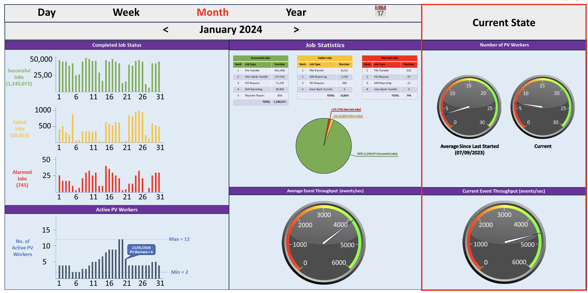

= Protocol Verifier Reporting

xtUML Project Analysis Note

== 1 Abstract

This note provides analysis of reporting requirements for the Munin
Protocol Verifier.  These requirements will flow backwards into the
strategy for logging <<dr-2>>.

== 2 Introduction and Background

Early in Project Munin, the engineering development team erred toward
over-logging and over-reporting, because clear requirements for both were
emerging.  The understanding of the application has grown.  Requirements
may now be surmised with some hope of usefulness.

In the Protocol Verifier application, reporting is a subset of logging.
Logging will conditionally gather a great deal of information.  A
multiplicity of logger categories and log levels will allow fine tuning of
what is useful for reporting and what is useful for performance
measurement, defect isolation, metrics and debug/trace scenarios.
This fine tuning will be possible through configuration (not requiring
code to be changed).

Reporting involves gathering information about the audit event stream
received from the system being monitored as well as gathering information
about the Protcol Verifier itself.

== 3 Requirements

=== 3.1 Dashboard Requirements

A dashboard shall be constructed which puts key metrics on display.
The dashboard will show statistics of the monitored system as well as
statistics of the Protocol Verifier.

==== 3.1.1 Monitored System Reporting

Following is a summary enumeration with details following.

* instantaneous throughput (events per second) (speedometer)
* throughput (events per second) over a time period ("area under the curve" line graph)
* jobs succeeded versus failed versus alarmed (pie chart:  green, yellow, red)
* list of alarmed job names with counters next to them counting the alarms sorted by incidence
* list of failed job names with counters next to them counting the failures sorted by incidence
* list of successful job names with counters next to them counting them sorted by incidence
* list of retried job names with counters next to them counting them sorted by incidence
* proportion of happy versus unhappy jobs (pie chart:  blue, purple)

===== 3.1.1.1 Instantaneous Throughput

The instantaneous throughput will display the throughput of the
Protocol Verifier "right now".  It may be time-averaged for smoothing but
the time window will be short.  This could be displayed in something like
a speedometer dial.

The units shall be events per second.

===== 3.1.1.2 Throughput Over Time

A graph of the throughput of the Protocol Verifier shall be displayed
supplying a view of the throughput over the last (say) 24 hours.
Optionally the display window could be adjustable.  The graph may be
coloured in an "area under the curve" fashion.

The units shall be events per second.

===== 3.1.1.3 Alarmed versus Failed versus Successful Jobs

A relative proportion of jobs that have ended in alarm conditions, failure
and success shall be displayed.  A pie chart with the different conditions
shown as different colours (e.g. red for alarm, yellow for failure and
green for success) shall make the proportions visually clear.

The units shall be total alarm/failure/success over a noted time period
(e.g. "today" or "last 24 hours").

===== 3.1.1.4 List of Alarmed Jobs

A list of job types that experienced alarm condition shall be displayed.
The names of the jobs shall be shown in a readable format.  A counter of
the number of alarms (over some period of time) shall be shown.  The list
shall be sorted in descending order starting with the job type receiving
the greatest incidence of alarms.

===== 3.1.1.5 List of Failed Jobs

A list of job types that failed shall be displayed.  The display format
shall follow the format described in <<3.1.1.4 List of Alarmed Jobs>>.

===== 3.1.1.6 List of Successful Jobs

A list of job types that succeeded shall be displayed.  The display format
shall follow the format described in <<3.1.1.4 List of Alarmed Jobs>>.

===== 3.1.1.7 List of Retried Jobs

A list of job types that experienced retries shall be displayed.  The
names of the jobs shall be shown in a readable format.  A counter of the
number of retries (over some period of time) shall be shown.  The list
shall be sorted in descending order starting with the job type receiving
the greatest incidence of retries.

===== 3.1.1.8 Proportion of Happy versus Unhappy Jobs

A relative proportion of happy jobs and unhappy jobs shall be displayed.
A pie chart with the two types shown as different colours (e.g. blue for
happy, purple for unhappy) shall make the proportions visually clear.

The units shall be total happy/unhappy job instances over a noted time
period (e.g. "today" or "last 24 hours").

==== 3.1.2 Protocol Verifier Self-Reporting

The Protocol Verifier provides metrics reflecting the behaviour of the
monitored system(s).  However, it is useful to track a few key
measurements supplying the current status of the Protocol Verifier itself.

Following is a summary enumeration with details following.

* PV uptime
* number of running worker PVs
* count of assigned jobs
* count of unassigned jobs

===== 3.1.2.1 Protocol Verifier Uptime

The amount of time elapsed since the Protocol Verifier was started shall
be displayed.

The units shall be in time duration format.

===== 3.1.2.2 Protocol Verifier Worker Count

The Protocol Verifier scales up and down to handle various audit event
stream loads efficiently.  An integer number representing the current
number of Protocol Verifier "worker" instances shall be shown.  A max
count and a minimum count shall display the maximum and minimum number
respectively over a period of time (such as 24 hours, or since the
Protocol Verifier started).

There are no units to this measurement.

===== 3.1.2.3 Count of Assigned Jobs (Jobs in Progress)

The number of jobs which Job Management has assigned to a worker shall be
displayed.

There are no units to this measurement.

===== 3.1.2.4 Count of Unassigned Jobs

The number of jobs which Job Management has seen but has not assigned to a
work shall be displayed.

There are no units to this measurement.

=== 3.2 Other Requirements

* Reporting shall be supplied through a Kafka message broker topic.
* The message shall be consumable by <<dr-3, Apache NiFi>>.

== 4 Analysis

Analysis for Protocol Verifier Reporting has been performed by the Munin
engineering team with little outside input.  However, as understanding of
protocol verification grew, an understanding of what would be useful on
the back end grew.  The above dashboard and reporting requirements emerged
from weeks of running the Protocol Verifier with simulated input audit
event streams.

=== 4.1 Questions

While testing the Protocol Verifier several questions arose.

* How fast is the PV running?
* How do we know when a job has failed?
* How do we identify a failed job?
* Which job types fail most often?
* How many jobs have failed?
* How many jobs have succeeded?
* How many jobs are receiving alarm conditions?
* What are the success/failure/alarm percentages?
* What are the names of the jobs that receive alarm conditions?
* Is the PV running optimally?
* How long has the PV been running?
* How does the throughput change when I adjust timing parameters?

It is expected that more questions and reporting requirements will emerge.
But for now, even basic usage of the Protocol Verifier raises these
questions.  Thus, let us build reporting to answer the questions we have
uncovered so far.

== 5 Work Required

=== 5.1 Protocol Verifier Instrumentation

. Craft a mock-up dashboard using a graphics drawing tool (e.g.  PowerPoint).
+
.Protocol Verifier Dashboard (MOCK-UP)

. Supplied with the requirements from this document, analyse the logging and
  reporting instrumentation supplied by the Protocol Verifier.
. Update the PV with sufficient logging and reporting to generate the data
  needed by the reporting dashboard.

=== 5.2 Protocol Verifier Back End

* Build a dashboard using appropriate technology.

=== 5.3 Technology Deployment

* Implement a Kafka-compatible endpoint using <<dr-3, Apache NiFi>>.

== 6 Acceptance Test

. Launch the Protocol Verifier in benchmarking mode with the regression
  suite set of job definitions.
. Launch the Protocol Verifier dashboard.
. See that all of the <<4.1 Questions>> can be answered.

== 7 Document References

. [[dr-1]] https://github.com/xtuml/munin/issues/189[189 - Enhance Reporting]
. [[dr-2]] link:./188_enhance_logging_ant.adoc[Enhance Logging Analysis Note]
. [[dr-3]] https://nifi.apache.org/[Apache NiFi]

---

This work is licensed under the Creative Commons CC0 License

---
