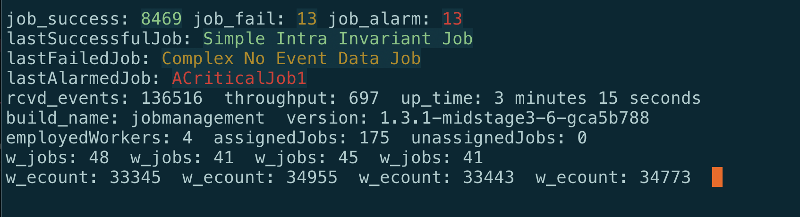

= Protocol Verifier Uptime and Version Reporting

xtUML Project Analysis Note

== 1 Abstract

This note supplies analysis and work requirements for adding the ability
to report the uptime (time since start-up) and version of the Protocol
Verifier to the back-end dashboard.

== 2 Introduction and Background

Various Protocol Verifier runtime behaviour statistics are already in
place.  It will be useful to know how long the PV has been running.  It
will be useful to know the version of PV that is running.  These two new
statistics will supply additional information to the back end reporting.

== 3 Requirements

=== 3.1 Uptime

Report the amount of time (duration) since the Protocol Verifier was
started.

=== 3.2 Version

Report the version of the running Protocol Verifier.

== 4 Analysis

=== 4.1 Uptime

Uptime will be calculated.  The base required is the start time of the
Protocol Verifier.

=== 4.2 Version

A new <<dr-1,feature>> has been added to MASL C++ for this purpose.  It is
now possible to access version properties from within MASL action
statements.

=== 4.3 Throughput

With uptime now available and together with the existing 'received events'
statistic, 'throughput' (in events per second) can be reported.

== 5 Work Required

=== 5.1 Uptime

. Add an attribute to JobManager to carry the timestamp of the start time.
. When Job Manager is created, initialise this start-up timestamp.
. Report this timestamp in the periodic Protocol Verifier Statistics
  log message.

=== 5.2 Version

Using the capability from <<dr-1,MASL>>, report the package name and
version in the periodic Protocol Verifier Statistics log message.

=== 5.3 `pvstats.py`

Update `pvstats.py` to report the new values on the dashboard.

== 6 Acceptance Test

`run_benchmark 2000 100000` and see new statistics.

== 7 Document References

. [[dr-1]] https://github.com/xtuml/masl/pull/52[Make package and dependency names available to MASL]

---

This work is licensed under the Creative Commons CC0 License

---

