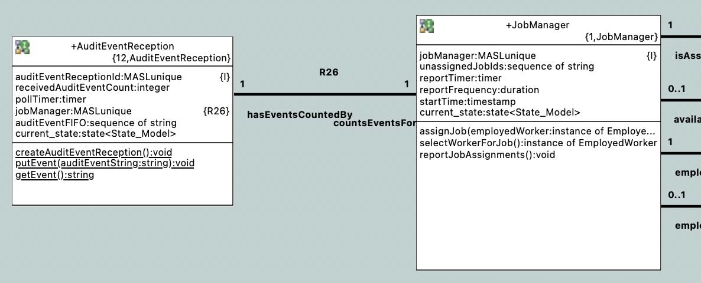
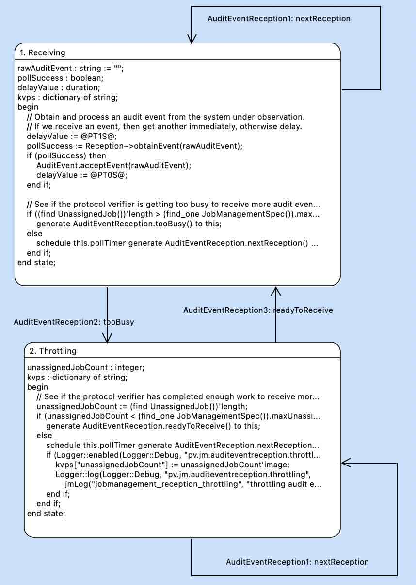

= Protocol Verifier Application Messaging Overrun

xtUML Project Analysis Note

== 1 Abstract

This note provides analysis around making an application (e.g. Protocol
Verifier) robust in the face of large quantities of extra-domain messages
(messages from outside the modelled domains) and specifically from a
persistent message broker (e.g. Kafka).

== 2 Introduction and Background

=== 2.1 Terminology

inter-domain message::
An inter-domain message is a message passed between application domains.
Both the publisher and subscriber are components of the application (e.g.
Protocol Verifier).  Both sender and receiver are under control of the
application.

extra-domain message::
An extra-domain message comes from outside the application.  The publisher
is not under the control of the application (Protocol Verifier).  The
sender is another application (e.g. system under observation) not part of
the application.

overrun::
Overrun is a condition in which an application accepts more work than it
can handle.  In the case of the Protocol Verifier, overrun occurs when the
number of audit events received from the system under observation exceeds the
number that the Protocol Verifier is able to instantaneously process.

throttling::
Throttling is a means of governing the reception of messages or other
stimuli from outside the application in order to avoid an overrun
condition.

=== 2.2 Problem:  Extra-domain Message Overrun

MASL C++ supports Kafka messaging for both inter-domain messaging and
extra-domain messaging.  As of May 2024, there was no distinction between
message handling for messages coming to the application from the outside
world and those representing inter-domain (intra-application) messaging.

This poses a problem.

In the context of a persistent message broker (e.g. Kafka), an application
can come online with a large number of extra-domain messages already
available for consumption.  Without some means of throttling these
"external" messages, the application can be overrun and become
overwhelmed.

Each extra-domain message triggers objects within the Protocol Verifier to
be created and held in memory.  Without throttling, the Protocol Verifier
will continue to create objects without bounds until memory runs out, and
the application crashes.

=== 2.3 Use Case

Here is a concrete scenario setting up the Protocol Verifier for an
overrun.

. Do not start the Protocol Verifier application, yet.
. Start Kafka and zookeeper creating the 'Protocol_Verifier_Reception' topic.
. Run `plus2json --job` to create job definitions.
. Run `plus2json --play` to produce a stream of run-time audit events.
  ** This will pre-populate the 'Protocol_Verifier_Reception' topic.
. After some time (e.g. 10 minutes, 1 hour, 8 hours), launch the Protocol Verifier.
  .. See it crash (without throttling).
  .. See it manage to "catch up gracefully" (with throttling).

Note that the extra-domain Kafka topic could have millions of messages
waiting.  The application must receive these at a rate that it can handle
allowing the domains to process as fast as practical without overrunning.

== 3 Requirements

=== 3.1 Overrun Protection

Provide a mechanism for the application to not receive a message(s) when
the application is not ready/able.

== 4 Analysis

In project Munin, there are both the architecture (MASL C++ model
compiler) and the application models (e.g. Job Management, Sequence
Verification).  To supply a means of throttling, one or both may change.

It is desirable to address issues like overrun by changing only the
architecture.  However, it seems that both the architecture and
application need changes to provide efficient throttling.

A few options have been identified for consideration in addressing the
above stated requirements.

=== 4.1 Buffer Limiting

* On any Kafka consumer, limit the number of messages consumed.
  ** When the limit is reached, wait until the buffer drains.

This option does not satisfy the requirements.  This option does not
actually limit the number of messages received; it just consumes them in
chunks.  Overrun would still occur.

=== 4.2 Rate Limiting

* Mark a maximum (average) rate of consumption for a consumer.

This option satisfies the requirements at the cost of tuning the
application with marks.  Such tuning would be complicated by the profile
of the deployment system and other factors.

=== 4.3 Ratio Limiting

* Mark a distinction between inter-domain consumers and extra-domain
  consumers.
* Give priority to inter-domain consumers.
  .. Only service extra-domain topics when inter-domain topics are empty?
  .. Service N extra-domain messages for each M inter-domain messages?

This could potentially meet the requirements.  However, it cannot work
without extensive application and hardware -specific tuning.

=== 4.4 Application-Level Throttling

* Provide a means by which the application can enable/disable message consumption.

For Protocol Verifier, Job Management has an instance population of
Unassigned Jobs.  When 'MaxUnassignedJobs' is exceeded, the application
could disable consumption of messages on the 'Protocol_Verifier_Reception'
topic.  After all jobs are assigned, it could enable consumption of more
extra-domain messages.

This option does satisfy the requirements.  However, it explicitly pollutes
the application with an architectural "hook".

A fairly clean example of this option is to add terminator service such as
`Reception~>requestEvent( eventCount : in integer )`.  Coupled with the
existing public service (`JobManagement::acceptEvent ( auditEvent : in
string )`), requestEvent could request a certain number of messages.

=== 4.5 Unable to Consume Exception

* Using a modelled exception, allow a domain service to raise the
  exception when it is unable to receive a message.
* The architecture could catch the exception and leave the incoming
  message uncommitted.  The message could be re-queued (after a delay?).

Even though this option does introduce some knowledge of the architecture
to the application, it does so in a clean, generic manner.  This option
would work equally well on extra-domain messaging and inter-domain
messaging.

However, in MASL C++, exceptions are primarily used for error conditions
and are quite heavy-weight, capturing the stack, etc.  Using exceptions
in non-error scenarios is not something we want to do at this time.

=== 4.6 Strictly Polled Event Reception

It could be considered careless design to expose an asynchronous messaging
interface that potentially can be overrun.  The primary means of receiving
messages only when ready is _polling_.  On an interface which needs to be
rate limited, polling is the standard approach.

Consider a terminator service that returns a single audit event.
`Reception~>obtainEvent( auditEvent : out string ) : boolean`.  Notice
that the parameter returns a value.  The return value will be true if an
event is actually received and false if no message is available.  This
terminator service will be invoked by the domain exactly as often as the
application can handle another input message (audit event).

This is the selected approach to solving the problem.  It requires that
MASL C++ be updated to support Kafka on polled receptions.  It requires
that the application model be updated to receive messages when it is in a
condition in which it can process the message.  The application model will
delay receiving messages when it is too busy and return to receiving when
it has "caught up".

== 5 Work Required

Both the application and the architecture are changed.

<<dr-2, Implement Kafka polled topics>> addresses the changes to the
architecture.  The remainder of this note will describe the changes to the
application models.

=== 5.1 Model

A new class, Audit Event Reception, is added to Job Management.  (It is
interesting/amusing to see Audit Event Reception return, as it was its own
domain in early Protocol Verifier development.)  This class is a singleton
and has as primary role to support behaviour to govern (throttle) the
reception of audit events from the system under observation.

The state machine receives audit events as fast as the system will allow
until "too many" have been received.  "Too many" is defined as having more
Unassigned Jobs than 'MaxUnassignedJobs' (in the system spec).

Upon receiving an audit event and discovering that 'MaxUnassignedJobs' has
been exceeded, Audit Event Reception will transition to 'Throttling' and
pause receiving for 1 second and continue checking the condition each second
(and blocking in the meantime and not using CPU cycles).  When the number
of Unassigned Jobs drops below 'MaxUnassignedJobs', Audit Event Reception
will transition back to 'Receiving'.

=== 5.2 Steps

. Add AuditEventReception class.
  .. auditEventReceptionId : MASLunique;
  .. pollTimer : timer;
  .. receivedAuditEventCount : integer;
     ... Remove receivedAuditEventCount from JobManager
  .. Add Receiving state.
     ... Receiving -- pop -> Receiving
     ... Receiving -- tooBusy -> Throttling
  .. Add Throttling state.
     ... Throttling -- pop -> Throttling
     ... Throttling -- readyToReceive -> Receiving
  .. Add creation and initialisation to the `init` function.
. Add 1:1 unconditional relationship from AuditEventReception to JobManager
  ** AuditEventReception counts_events_for 1 JobManager
  ** JobManager has_events_counted_by 1 AuditEventReception
. AuditEvent
  .. Move the bulk of domain service 'acceptEvent' here as a class-based operation.
. obtainEvent
  .. temporary behaviour:
     ... Add event body to auditEventFIFO.
  .. permanent behaviour:
     ... Magically receive one message from Kafka topic.
     ... Commit it (Kafka).

== 6 Acceptance Test

=== 6.1 Regression

Run the `regression.sh` script and see it pass.

=== 6.2 Benchmark Stress

The `run_benchmark.sh` script has been updated to support a (3rd) command
line argument that represents the number of events to pre-populate the
Protocol Verifier Reception topic.  After topic pre-population, the PV
will be launched, and the additional events played into the application.

* Run the `run_benchmark.sh` script with default parameter values (none)
  and see it pass.
* Run the `run_benchmark.sh 500000 1000 100000` and see it pass.  Note
  that this configuration will pre-populate the message broker with 100000
  audit events, start up the Protocol Verifier and then run another 500000
  audit events.

== 7 Document References

. [[dr-1]] https://github.com/xtuml/munin/issues/219[219 - Application Messaging Overrun]
. [[dr-2]] https://github.com/xtuml/masl/pull/56[56 - Implement polled Kafka topics]

---

This work is licensed under the Creative Commons CC0 License

---
