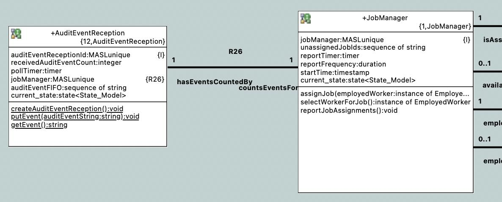
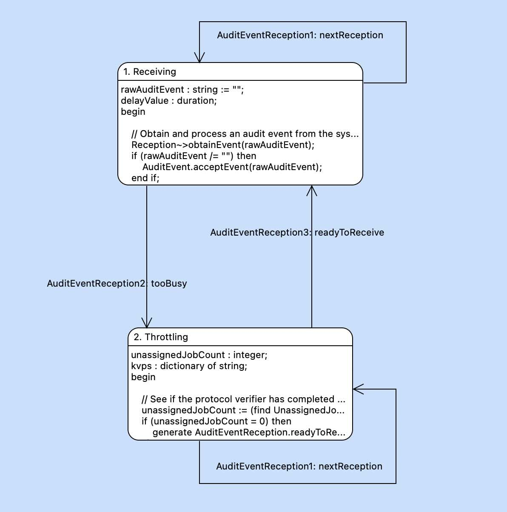

= Application Messaging Overrun

xtUML Project Design Note

== 1 Abstract

See <<dr-1,Application Messaging Overrun Analysis Note>>.

== 2 Introduction and Background

See <<dr-1,Application Messaging Overrun Analysis Note>>.

== 3 Requirements

See <<dr-1,Application Messaging Overrun Analysis Note>>.

== 4 Analysis

See <<dr-1,Application Messaging Overrun Analysis Note>>.

== 5 Design

=== 5.1 Model

=== 5.2 Steps

. Add AuditEventReception class.
  .. auditEventReceptionId : MASLunique;
  .. pollTimer : timer;
  .. receivedAuditEventCount : integer;
     ... Remove receivedAuditEventCount from JobManager
  .. Add Receiving state.
     ... Receiving -- pop -> Receiving
     ... Receiving -- tooBusy -> Throttling
+
          rawAuditEvent := Reception~>takeEvent()
          AuditEvent.acceptEvent(rawAuditEvent)
          if (unassigned'length > max) then
            gen too_busy to self
          else
            if (rawAuditEvent) then
              delay_value := 0
            else
              delay_value := PT1S
            end if
            gen pop to self delay delay_value
          end if

  .. Add Throttling state.
     ... Throttling -- pop -> Throttling
     ... Throttling -- readyToReceive -> Receiving
+
          if (unassigned'length = 0) then
            gen readyToReceive to self
          else
            gen pop to self delay PT1S
          end if
  .. Add creation and initialisation to the `init` function.
+
     create unique AuditEventReception( Current_State => Receiving )
     link AuditEventReception to JobManager across R26

. Add RawAuditEvent class.
  ** sequenceId : MASLunique
  ** body : string
. Add 1:1 unconditional relationship from AuditEventReception to JobManager
  ** AuditEventReception counts_events_for 1 JobManager
  ** JobManager has_events_counted_by 1 AuditEventReception
. acceptEvent
  .. select auditEventReception
  .. increment auditEventReception.receivedAuditEventCount
  .. Create RawAuditEvent instance with receivedAuditEventCount as identifier
     and auditEvent string as the body.
  .. In a temporary step, call AuditEvent::acceptEvent( rawAuditEvent.body )
. AuditEvent
  .. Copy bulk of acceptEvent here as class-based operation.
. Switch takeEvent and obtainEvent signatures.
. takeEvent
  .. temporary behaviour:
     ... select any RawAuditEvent
     ... Copy rawAuditEvent.body.
     ... delete rawAuditEvent
     ... return rawAuditEvent.body.
  .. permanent behaviour:
     ... Magically receive one message from Kafka topic.
     ... Commit it.

== 6 Design Comments

== 7 User Documentation

N/A

== 8 Unit Test

== 9 Document References

. [[dr-1]] https://github.com/xtuml/munin/issues/219[219 - Application Messaging Overrun]
. [[dr-2]] link:219_overrun_ant.adoc[Application Messaging Overrung Analysis Note]

---

This work is licensed under the Creative Commons CC0 License

---
