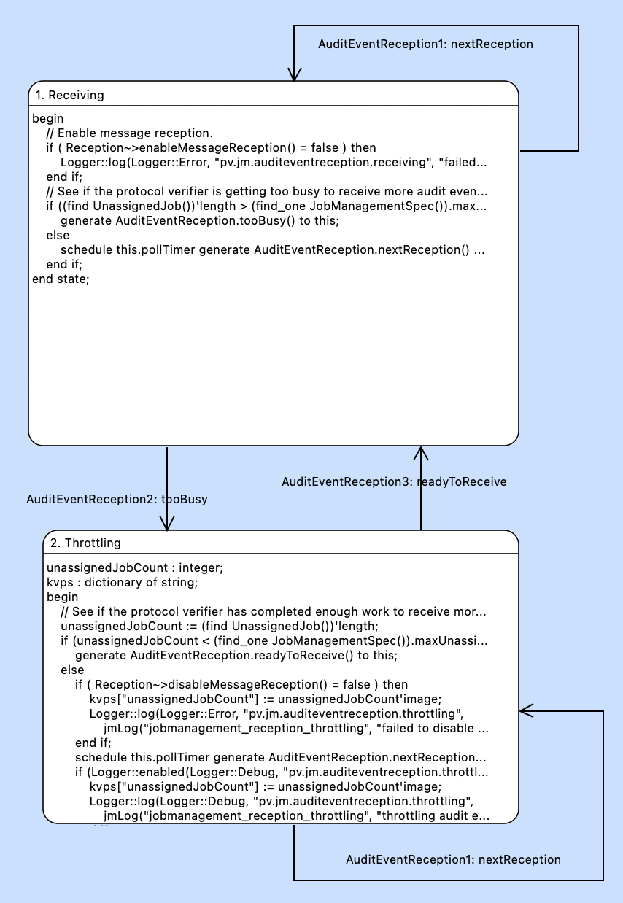

= Reception Streamlining

xtUML Project Analysis Note

== 1 Abstract

This note provides requirements, analysis and work required to streamline
audit event reception.

== 2 Introduction and Background

The primary approach to messaging in the MASL idiom is via asynchronous
signals received through domain services.  A received message initiates a
thread of control within the receiving domain.  This approach is fine when
the number and frequency of message receptions is within performance
limitations.  However, in the face of large numbers of messages arriving
at a high frequency, a means of throttling is necessary.

This issue was solved when messaging through Kafka by using a polled
messaging approach.  This enabled the Protocol Verifier to receive messages
only when ready and when it requested (polled for) them.

Protocol Verifier is now required to run on AMQP (via ActiveMQ).  AMQP
does not support the polled approach to messaging, but instead provides a
mechanism to enable and disable asynchronous reception.  This mechanism
has been implemented while preserving the mechanism for polled message
reception, so that we can support both AMQP and Kafka.

However, a decision has been made to use the enable/disable reception for
both AMQP and Kafka.  Thus, the polling mode of message reception is no
longer needed.

It is recommended that <<dr-3>> be read in its entirety before continuing.
<<dr-3>> will recommend that <<dr-2>> be read first.  :)  The problem
statement and analysis in <<dr-2>> apply here.  The terminology defined in
<<dr-2>> will be used in this note.

== 3 Requirements

. Remove the calls to the polling message terminator from the Audit Event
  Reception state machine activities.
. Assure that message reception is enabled by default, and that it is
  infeasible for the Protocol Verifier to get stuck with message reception
  disabled.

== 4 Analysis

=== 4.1 Calls to Polling Terminator

In the 'Receiving' state of the state machine for 'Audit Event Reception',
a call is made to the 'Reception~>obtainEvent' terminator service.  This
call no longer does anything and is hard-coded to return 'false'.  We can
remove this call.  We will leave the terminator service itself in place
for now.

=== 4.2 Assuring Message Reception Stays Enabled

* When 'AuditEventReception' is in the 'Receiving' state, message
  reception is enabled.
* When 'AuditEventReception' is in the 'Throttling' state, message
  reception is disabled.

It is understood that message reception will be "enabled" even when it is
already enabled.  This will occur every 1 second.  It is understood that
this operation is safe to the underlying messaging adapter.  The upside is
that regardless of the state of the message broker at boot time, messaging
will be enabled by the Protocol Verifier, because PV defaults Audit Event
Reception to the 'Receiving' state.  Also, if some glitch would disable
message reception, this periodic re-enablement would work around that
glitch.

== 5 Work Required

. In the 'AuditEventReception' 'Receiving' state, make the following
  changes.
  .. Unconditionally enable message reception by calling
     `Reception~>enableMessageReception()`.
  .. Remove the 'pollSuccess' local variable declaration.
  .. Stop calling 'Reception~>obtainEvent'.

. In the 'AuditEventReception' 'Throttling' state, make the following
  changes.
  .. Remove the call to `Reception~>enableMessageReception()`.

== 6 Acceptance Test

=== 6.1 Regression

Run the `regression.sh` script and see it pass.

=== 6.2 Benchmark Stress

. Run the `run_benchmark.sh` script and see it pass with adequate
  throughput.

== 7 Document References

. [[dr-1]] https://github.com/xtuml/munin/issues/262[262 - audit event reception throttling]
. [[dr-2]] link:219_overrun_ant.adoc[Protocol Verifier Application Messaging Overrun Analysis]
. [[dr-3]] link:262_message_throttling_ant.adoc[Message Throttling]

---

This work is licensed under the Creative Commons CC0 License

---
