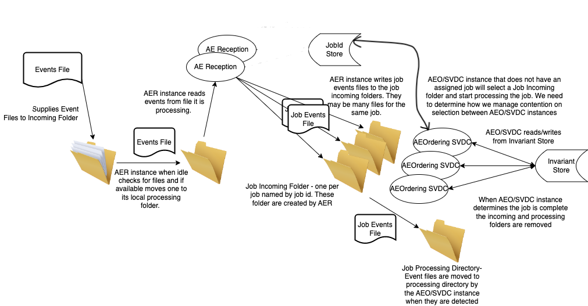
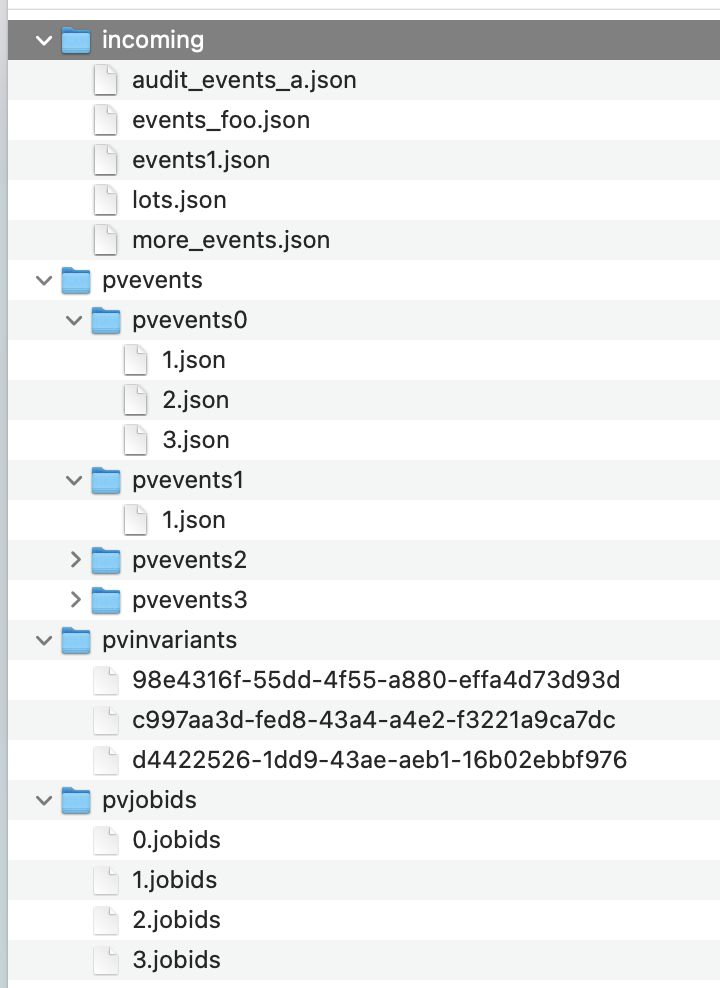

= Munin Preliminary Scaling

xtUML Project Analysis Note

== 1 Abstract

This note identifies potential for concurrency and points of data access
contention in the Protocol Verifier.  Alternatives are analysed for
scaling the application to higher throughput.  A path forward is proposed.

== 2 Introduction and Background

In Munin Phase 1 the scalability of the Protocol Verifier application is
explored.  The purpose of the exploration is to demonstrate that the application
can be scaled to production volumes of data throughput in Munin Phase 2.

At the end of Phase 1 Stage 3 of development, the Protocol Verifier is
composed of three interacting domains operating much like a serial pipe.
AEReception receives the audit events and passes them to AEOrdering.
AEOrdering sequences the audit events and passes them to Sequence
Verification which enforces rules of topology and constraints.

== 3 Requirements

=== 3.1 Throughput as Audit Events per Unit Time

The primary performance requirement is the ability to process many audit
events per unit time.  These audit events will be associated with multiple
concurrent jobs.

=== 3.2 Minimise Performance-Impacting Contention

The Protocol Verifier must enforce constraints that span jobs.
Constraints that require persistence of elements must operate across
multiple jobs separated by time and CPU process.  This is not a new
requirement, but it is a new challenge based on JobID reuse detection and
support of long duration usage of invariants.  These requirements span
shutdown/restart cycles.

.Stream Splitting, JobID Store, Invariant Store

== 4 Analysis

=== 4.1 General Nature of the Workflow

Any particular _Job_ is largely a sequential process.  Opportunities for
concurrency within a job are minimal and more challenging to leverage.
However, a single job is a relatively small task and can run mostly
independently of other jobs.

The primary opportunity for parallelism is to support the processing of
multiple concurrent jobs.

=== 4.2 Workflow Partitioning by Job

Audit events arriving at the Protocol Verifier may be partitioned into
separate streams.  Let us call this process 'stream splitting'.  A single
stream of audit events may by split into several separate streams of audit
events.  It is critical that all audit events for any single job are split
into the same stream.

As a simple example, consider splitting a stream of audit events into two
separate streams based upon the value of the JobID.  All audit events
carrying JobIDs with an _even_ value are output into one stream; all audit
events carrying JobIDs with an _odd_ value are output into another stream.
This would result in two streams which could be processed by two largely
independent Protocol Verifier instances.  This same process could be used
to split an incoming stream of audit events into an arbitrary number of
separate streams.

The number of split audit event streams shall be configurable.

This is the primary strategy for partitioning the processing and leverages
the <<4.1 General Nature of the Workflow>>.

It is noted that a job may fail for multiple reasons.  It is desireable
that the detection of JobID reuse is reported even for jobs that fail for
other reasons.  It seems that repeatedly failing duplicate jobs could be
indication of some sort of "flooding" and will be important to detect.

==== 4.2.1 Audit Event Stream Splitting

Audit events arrive from the monitored system into a single incoming
filesystem directory called (say) 'pvincoming'.  Instances of AEReception
read these files, validate their format against a schema and write to N
separate output folders named (say) 'pvevents<n>' using the splitting
strategy described above.  Inside the 'pvevents<n>' directory, the
splitter writes files named uniquely within the context of the given
folder.  The quantity of audit events written to a particular file is
configurable as is the amount of time any file is kept open.  These
configuration values tune the size and frequency of the data arriving to
each instance of the Protocol Verifier back end (AEOrdering + Sequence
Verification).

Each 'pvevents<n>' folder serves as the incoming events directory for an
instance of AEOrdering + Sequence Verification.  This implies that
AEO+SVDC will always come in pairs and will likely be a single combined
runtime application.

Working directories may be necessary.  Files are moved when released
to the next stage to avoid contention between multiple processes.

.Protocol Verifier Workspace

=== 4.3 Persistence and Contention

Two requirements which imply persistence and contention are identified.
Firstly, the Protocol Verifier must detect the reuse of a JobID.  To
accomplish this, JobIDs must be persisted and queried during the
processing of future jobs.  Secondly, the Protocol Verifier must enforce
constraints involving __extra-job invariants__, values carried in one job
that must match values carried in other jobs.  This also implies that
these values are persisted so that they may be queried later in time and
across separately split streams of audit events and separate processes.

==== 4.3.1 JobID Store and Invariant Store

Two separate persistent stores are needed to maintain JobIDs and invariants across
time and concurrent processing.  A simple filesystem-based approach is
likely to be sufficient using techniques to minimise contention.  However, other
persistence mechanisms may be explored.

==== 4.3.2 Contention Management

The JobID and invariant stores must serialise access to data contained
within them.  Contention shall be minimised by splitting the values
across multiple files, thus dividing the probability of one process having
to wait on another by the number of files used to store the JobID or
invariant.

The JobID store will use a technique similar to that used to split the
audit event stream.  The JobID store will persist JobIDs into files based
upon the value of the JobID.  The number of JobID
files will be based upon the number of split audit event streams as
described in <<4.2 Workflow Partitioning by Job>>.  This will reduce (or
eliminate) contention on the JobID files.

This design proposal would result in there being:

* a separate deployment of the AEOrdering/Sequence Verification executable
  for each instance of the incoming job folders (the 'pvevents' folders)
* One instance of the JobID store (file) per deployment of the
  AEOrdering + Sequence Verification (AEO+SVDC) executable.

NOTE:  Note that if the JobID store is divided in a manner congruent to
       the way the audit event stream is split, then there will be no
       inter-process contention for the JobID store.  However, let us keep
       the design flexible to allow for a different scheme of JobID file
       partitioning.

==== 4.3.3 Reading and Writing Persistent Stores

===== 4.3.3.1 Reading and Writing the JobID Store

The JobID store is a filesystem directory named (say) 'pvjobids' containing N1
(configured) files holding JobIDs.  A JobID file is named with a number.
It contains only JobID (sets of) strings, one (set) per line.

It is desireable to detect the duplicate JobID as soon in the processing
as feasible without requiring the JobID store to be queried more than once
per job (for throughput and contention reasons).

Duplicate JobID detection could be implemented in AEReception, however this would
require querying the JobID store once for each audit event received.  This
would have the negative consequences of reduced throughput and aggravated
contention within the persistent store.

JobID detection could be implemented in Sequence Verification.  However,
this poses a couple of disadvantages.  Firstly, Sequence Verification is
relatively late in the processing of the job.  Secondly, this introduces
the complication of potentially needing to report multiple reasons for a
job failure.

This leaves detecting duplicate JobIDs in AEOrdering.  AEOrdering is
relatively early in the processing and yet after the job stream splitting
step, thus guaranteed to see all audit events with a particular JobID.  Like
Sequence Verification, AEOrdering is able to detect reuse with a single
query per job to the JobID persistent store.  AEOrdering also will detect
JobID reuse before other (secondary) errors would be detected.

The mechanics of the check are as follows.  At the start of any new job,
Protocol Verifier (in AEOrdering) queries the appropriate JobID file.  If
the JobID does not exist, it adds it.  If the JobID does exist, a JobID
reuse error is reported.

===== 4.3.3.2 Reading and Writing the Invariant Store

The invariant store is a filesystem directory named (say) 'pvinvariants'.
An invariant file is named by the invariant value and contains the
invariant label and other properties.  Alternatively, these could be
grouped by "least significant digit" and contain several in a single file.
It is yet to be determined how many invariants will be seen by a running
Protocol Verifier.

When Sequence Verification detects the definition of an invariant, it
writes the properties into the invariant file.

When Sequence Verification detects the usage of an extra-job invariant and
does not find it in its own cache, it queries the appropriate invariant
file.  If it finds it, it caches it.  If it does not, it reports an error.

===== 4.3.3.3 Expiring and Pruning

Persistent stores will need to be pruned in some configurable manner.  No
specific requirements for pruning or JobID expiration are established in
Munin Phase 1.  However, configurability will be kept in mind during this
early development.

=== 4.4 Assumptions

==== 4.4.1 JobID Uniqueness and Randomness

Each job is identified with a `JobID`.  At this stage of the work, an
assumption is made that JobIDs are unique between different jobs.  And, in
fact, it is an error to see the same JobID on more than one job.

It is also assumed that JobIDs have relatively random values (UUIDs) or
that they are monotonic in nature.

It is noted that there may be a requirement in the future to deal with
"sets" of JobIDs and "correlation IDs".

==== 4.4.2 Duplication versus Retry

The Protocol Verifier understands no concept of 'retry'.  The Protocol
Verifier knows only about jobs and the successful or unsuccessful
completion of them.  It is assumed that a job that is being retried
(re-submmitted at the application level) carries a new and unique JobID.

==== 4.4.3 No Dynamic Scaling

In Munin Phase 1 there will be no consideration of _dynamically_ scaling
the throughput of the Protocol Verifier.  __Dyanmic scaling__ would allow
the number of running instances of AER and AEO+SVDC to change during
runtime perhaps based on the load of the system.  This is a desirable
feature.  However, this is not to be supported in Phase 1.

It is noted that the strategy for stream splitting must be revisted if
dynamic scaling is to be supported.

=== 4.5 Notes

. As noted above, the dependence on form and multiplicity of JobID may be
  endangering this design to be brittle.
. Some research and analysis should be done to understand the impact of
  audit event stream splitting and persistent store partitioning.  How many
  streams is too many?  How many files in a folder is too many?
. The technique used to validate schemas may be important.  Schema
  validation in AEReception could prove to be a bottleneck.  This should
  be measured.

== 5 Work Required

=== 5.1 Separate AEReception from AEOrdering and Sequence Verification

. Build AEReception to run independently (in a process by itself) of
  AEOrdering + Sequence Verification.
. Change the interface between AEReception and AEOrdering to be file
  based.
. Update the integration build process.
. Do this step first and test an integration build.

=== 5.2 Enhance AEReception to Perform Audit Event Stream Splitting

. Add support for a configurable number of output audit event streams
  including the capability to write files based on number of audit events
  and/or duration of time.
. Isolate the algorithm used to split the audit event streams, so that
  alternative algorithms can be easily implemented in the future.

=== 5.3 JobID Store

Update AEOrdering to write and read a JobID store.  Use an approach
that insulates the application from the underlying persistence mechanism.

=== 5.4 Invariant Store

Update Sequence Verification to write and read an invariant store.  Use an
approach that insulates the application from the underlying persistence
mechanism.

== 6 Acceptance Test

=== 6.1 Throughput

. Using the AESimulator, produce a known volume of audit events large
  enough to require at least 5 minutes of Protocol Verifier processing time.
. Configured as a single instance, run and time AEReception alone to
  understand its own independent throughput and capacity.
. Configured as a single instance, run and time AEO+SVDC alone to
  understand its own independent throughput and capacity.
. Configured as a single instance, run and time the Protocol Verifier (AER
  and AEO+SVDC) and calculate the throughput.
. Configured as concurrent instances, run and time the Protocol Verifier
  and calculate the throughput.

== 7 Document References

. [[dr-1]] https://onefact.atlassian.net/browse/MUN-151[Draft scaling plan.]

