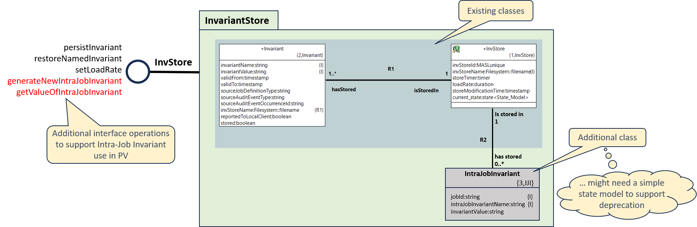

= Using Intra-Job Invariants in the Protocol Verifier Instrumentation

xtUML Project Analysis Note

== 1 Abstract

This note documents thoughts on use of intra-job invariants in PV Instrumentation events.

== 2 Introduction and Background

The Munin team is instrumenting the Protocol Verifier to explore
and test the various use cases of protocol verification.  Since the
Protocol Verifier (PV) is itself an observable device that implements a
protocol, the PV is being instrumented for observability and will be used
as both the observer and the device under observation.

This paper discusses the use and potential benefits of including the use of intra-job invariants within
the instrumentation events generated by the PV itself.

=== 2.1 Why would we add this feature?

Firstly, the use of __intra-job invariants__ in instrumentation events generated by the PV are potentially 
useful in the context of verifying the behaviour of the PV itself (by __PV Prime__).

Secondly, it extends the coverage of the verification mechanisms used in the instrumentation of PV.

Finally, it provides further evidence for the extent that PV "eats its own dog food" - i.e. bootstrapping the PV such 
that it's own behaviour can be tested and verified.

=== 2.2 Alternative mechanisms for creating and using intra-job invariant in PV

Several alternative mechanism were considered...

==== 2.2.1 A new domain

A relatively simple new domain would be added to the PV which would be responsble for managing the creation and
use of intra-job invariants within the instrumented PV.

==== 2.2.2 Extending the functionality of the Invariant Store domain.

The Invariant Store domain currently manages the use of __extra-job invariants__ (used across jobs within a monitored system) for and on behalf
of the PV. It is designed to support multiple deployment instances of the PV such that the behavior of jobs that use extrajob invariants which
are processed by __different__ instances of PV can still be verified.

Extending the Invariant Store domain to support __intra-job invariants__ seems like a natural 'home' for the required functionality.

==== 2.2.3 Extending the functionality of the Verification Gateway domain.

The Verification Gateway domain is responsible for 'stitching together' the instrumentation events generated by the PV into sequences 
that can be used to verify the behaviour of the PV itself (__PV Prime__). Consideration was given to extending its current functionality
to augment the PV-generated events with the necessary intra-job invariants. This option was quickly rejected as it essentially lets the PV
__off the hook__ from behaving in a way expected of a monitored system - it should be the PV's responsibility entirely to use intra-job invariants 
appropriately, and not rely on some other domain to __artificially__ add these in after the events have been generated.

=== 2.3 Delivery Point

The extensions to support the use of intra-job invariants within the instrumentation of the PV are not themselves expected to require a 
major revison to the functionality of the PV. However, the September 2023 release of the Protocol Verifier already includes significant
extensions (__especially in respect of support for unhappy events__) and with a code-freeze imminently. As such, it is proposed that the 
functionality extensions outlined in this paper should be thoroughly reviewed and agreed before embarking on their implementation in the 
__next__ delivery phase. 

== 3 Proposal

=== 3.1 Update ProtocolVerifier job specification

The ProtocolVerifier job specification needs to be extended to include the use of intra-job invariants on two or more events 
in the PV job sequence. Initially, this could be limited to defining:

   - the __source__ of an intra-job invariant on the first SVDC-generated happy event in the PV sequence (SVDC_PVSequencingStart)
   - a __use__ of the intra-job invariant on the final happy event in the sequence (SVDC_PVJobSuccessful)
 
This can readily be amended/extended following initial implementation and testing.

=== 3.2 Extend Invariant Store to provide additional services for Intra Job Invariants

The following illustrates the proposed extensions to the InvariantStore domain to provide support
for use of intra-job invariants in the instrumented PV.

.Proposed extensions to Invariant Store

An additional class __IntraJobInvariant__ linked to __InvStore__ via association __R2__ is proposed.

Two new operations would be required on the __InvStore__ provided interface:

  - generateNewIntraJobInvariant (creates an instance of IntraJobInvariant (for a specified job) and generates a new invariant value)
  - getNamedIntraJobInvariant (gets the invariant value for a named invariant of a specified job)

=== 3.3 Update instrumentation events in SVDC and AEO 

Update the places in SVDC and AEO where the PV instrumentation events that use intra-job invariants are generated.

=== 3.4 Extend terminator services in AEO and SVDC

The terminator services in SVDC and AEO will need to be updated to include passing of the intra-job invariants to the Verification Gateway domain.

=== 3.5 Expand and Refine Documentation

Continue to upgrade and maintain usage notes with an eye toward long-term
support of the Protocol Verifier and its user base.

== 5 Work Required

TBD - but as outlined above.

== 6 Acceptance Test

TBD

== 7 Document References

. [[dr-1]] https://onefact.atlassian.net/browse/MUN2-122[MUN2-122]

---

This work is licensed under the Creative Commons CC0 License

---
