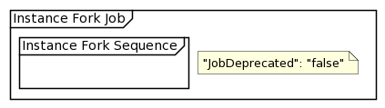
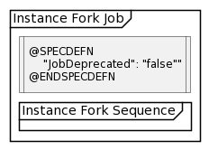
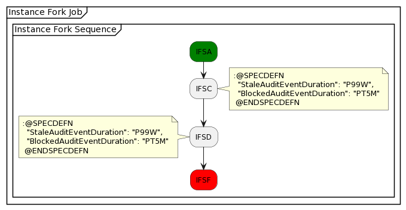
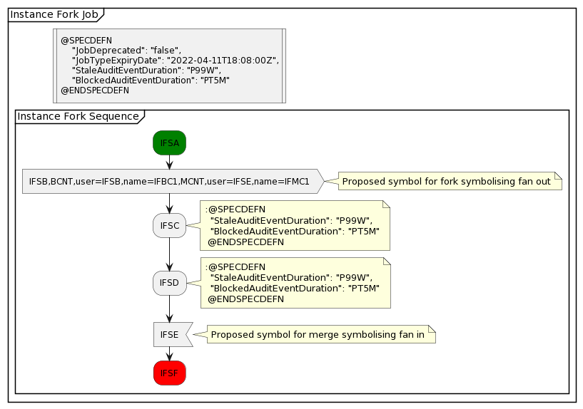

= Proposal for Configuration of Job Definition Specific Controls

xtUML Project Analysis Note

== 1 Abstract

Currently in PV it is possible to configure specific controls that are to be
applied to a job definition in the pv-config.json file. It would be
advantageous if this configuration data could be capture in the definition
of the Job using PLUS. This note summarises the investigation and proposes a solution.

== 2 Introduction and Background

The proof of concept for PV provided a config file that captured the configuration data
for the Protocol Verifier and the definitions of the Jobs that were to be processed.
Investigation was performed on using Plant UML to define the Job Definitions which resulted
in the PLUS language and plus2json tooling to generate Job Definitions into individual json files.
Currently it is not possible to define in PLUS if a job is deprecated or if there are different
timing constraints for stale and blocked events against a job or individual events and these
definitions are still captured in the pv-config.json introducing a disconnect between
the job definition and some of the control behaviour that needs to be captured for the job.

== 3 Requirements

The pv-config.json specification file allows the system administrator to set default durations

* DefaultStaleAuditEventDuration
* DefaultBlockedAuditEventDuration

that will be applied to all jobs.

In addition the pv-config currently allows the System Administrator to define in specific durations
for individual jobs and specific events in the job using the following:
[source,json]
----
  "Jobs": [
    {
      "JobDefinitionName": "FileRequest",
      "JobDeprecated": "false",
      "JobTypeExpiryDate": "2022-04-11T18:08:00Z",
      "StaleAuditEventDuration": "P99W",
      "BlockedAuditEventDuration": "PT5M",
      "EventRules": [
        {
          "EventName": "TestEvent1",
          "ApplicationName": "node1",
          "OccurrenceId": "1",
          "BlockedAuditEventDuration": "PT1H"
        }]
    },
    {
      "JobDefinitionName": "SourceFileRequest",
      "JobDeprecated": "false",
      "JobTypeExpiryDate": "2022-04-11T18:08:00Z",
      "StaleAuditEventDuration": "P99W",
      "BlockedAuditEventDuration": "PT5M"
    }
  ]
----
The definition of these values for jobs and specific events should not be the responsibility of
the System Administrator but should be specified by the Job Designer.

. The PLUS Job Definition shall provide the Job Designer with a mechanism to define job specific
specification data in a Plant UML Activity Diagram.
. The PLUS Job Definition shall provide the Job Designer with a mechanism to define job event specific
specification data.
. The plus2json tool shall generate the appropriate json for the Job Definition to define job and
event specification data.
. AEOrdering shall be able to populate the job and event specification data.

== 4 Analysis

The options for capturing this data in a Plant UML activity diagrams are limited with either the
*Action* or the *Note* being the most appropriate syntax blocks to capture this information.

The *Note* can be placed either on the left or the right of an element and can be either floating
or attached. It is no longer possible to have a *Note* at the top or bottom of an activity as this
has been deprecated. If we chose to use *Note* for the Job Definition specification data then this
would wither have to be on the left or right of the diagram and it is not aesthetically pleasing as
shown in the example below:

.Example of Job Definition Specification in Note on right

Therefore to capture the specification for a job the recommendation is that an *Action* is used just
after the job definition as indicated by the *partition* keyword. To differentiate the action from other
actions it is recommended that the action is rendered as a box as shown in the example below:

[source,puml]
----
@startuml
partition "Instance Fork Job" {
:@SPECDEFN
    "JobDeprecated": "false"
@ENDSPECDEFN|
detach
}
@enduml
----

.Example of Job Definition Specification Block

The specification data is captured inside two keywords *@SPECDEFN* and *@ENDSPECDEFN* that we shall use to define the
contents as specification data. If they do not exist then the plus2json processor should not
treat it as a job specification block. The content inside should be specified as if it were json.
For the Job Definition specification the Job Designer
shall have to use the detach keyword after the *action* to prevent a transition being added.

The difference for Event Specification Data is that we need to be able to associate the data
with the event. To achieve this we can use the *note* which can be attached on the *right* or the *left*
as can be seen in the example below:

[source,puml]
----
@startuml
partition "Instance Fork Job" {
group "Instance Fork Sequence"

  #green:IFSA;
  :IFSC;
  note right
  :@SPECDEFN
    "StaleAuditEventDuration": "P99W",
    "BlockedAuditEventDuration": "PT5M"
   @ENDSPECDEFN
  end note
  :IFSD;
  note left
  :@SPECDEFN
    "StaleAuditEventDuration": "P99W",
    "BlockedAuditEventDuration": "PT5M"
   @ENDSPECDEFN
  end note
  #red:IFSF;
end group
}
@enduml
----

.Example of Job Definition Event Specification Block

The specification data is captured inside two keywords *@SPECDEFN* and *@ENDSPECDEFN* that we shall use to define the
contents as specification data.

Here is a full example using the Instance Fork Job:

[source,puml]
----
@startuml
partition "Instance Fork Job" {
:@SPECDEFN
    "JobDeprecated": "false",
    "JobTypeExpiryDate": "2022-04-11T18:08:00Z",
    "StaleAuditEventDuration": "P99W",
    "BlockedAuditEventDuration": "PT5M"
@ENDSPECDEFN|
detach
group "Instance Fork Sequence"

  #green:IFSA;
  :IFSB,BCNT,user=IFSB,name=IFBC1,MCNT,user=IFSE,name=IFMC1>
  note right
    Proposed symbol for fork symbolising fan out
  end note
  :IFSC;
  note right
  :@SPECDEFN
    "StaleAuditEventDuration": "P99W",
    "BlockedAuditEventDuration": "PT5M"
   @ENDSPECDEFN
  end note
  :IFSD;
  note right
  :@SPECDEFN
    "StaleAuditEventDuration": "P99W",
    "BlockedAuditEventDuration": "PT5M"
   @ENDSPECDEFN
  end note
  :IFSE<
  note right
    Proposed symbol for merge symbolising fan in
  end note
  #red:IFSF;
end group
}
@enduml
----

.Example of Job Definition

Consideration could be given to making the individual specification parameters keywords to be processed. This is discounted
as allowing json like definition provides more flexibility.

The output that the plus2json processor should produce is to add the Job Definition Specification

	"JobDeprecated": "false",
	"JobTypeExpiryDate": "2022-04-11T18:08:00Z",
	"StaleAuditEventDuration": "P99W",
	"BlockedAuditEventDuration": "PT5M",

if provided to the job section of the Job Definition json file and to add the Event Definition Specification

      "StaleAuditEventDuration": "P99W",
      "BlockedAuditEventDuration": "PT5M"

if provided to the appropriate event section on the Job Definition json file as can be seen below:

[source,json]
----
{
  "JobDefinitionName": "Job2",
	"JobDeprecated": "false",
	"JobTypeExpiryDate": "2022-04-11T18:08:00Z",
	"StaleAuditEventDuration": "P99W",
	"BlockedAuditEventDuration": "PT5M",
  "Events": [
    {
      "EventName": "TestEvent18",
      "SequenceName": "Sequence4",
      "OccurrenceId": 1,
      "Application": "App5",
      "SequenceStart": true,
      "StaleAuditEventDuration": "P99W",
      "BlockedAuditEventDuration": "PT5M"
    }]
}
----

== 5 Work Required

=== 5.1 PLUS

Update the plus definition to cover the addition of an *action* box and *note*
containing the special keywords *@SPECDEFN* and *@ENDSPECDEFN* to allow the Job Designer to
specify the job and event specific configuration.

=== 5.2 plus2json

Update plus2json to process the new definition and produce a job definition json file
containing the specification data.

=== 5.2 AEOrdering

Update AEOrdering to remove the job and event specific configuration data from the pv-config.json
and to read in the job and event specific configuration data from the job definition file.
