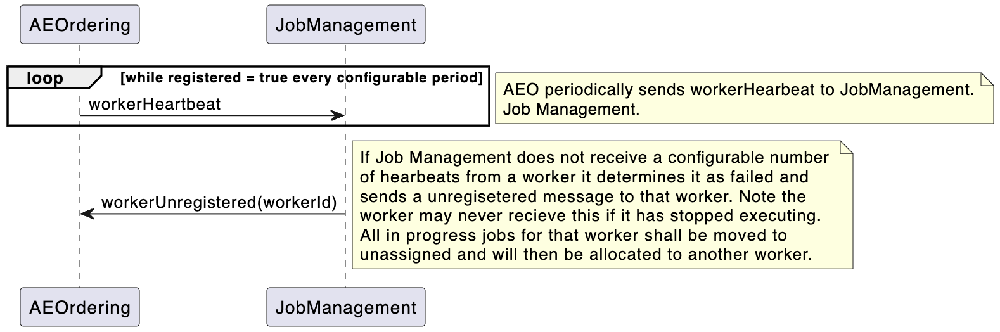

= Munin Horizontal Scaling Design

xtUML Project Design Note

== 1 Abstract

This note identifies the design for adding in a Job Management domain to aid 
in the solution for horizontal scaling.

== 2 Introduction and Background

The current Munin solution allows us to scale and meet the current requirement 
for scaling but is limited in that it does not allow for dynamic scaling of Munin.

This design note sets out what can be achieved and introduces a new domain 
Job Management that shall be used to manage the assignment of jobs to PV workers.

== 3 Design

If we want to increase the number of PV processes in the current design to manage 
the allocated lanes, it is necessary to stop the running system and reconfigure to
define new instances of PV and their assigned lanes.

This solution makes use of the worker pattern allowing PV instances to be started 
without the use of fixed lanes. Jobs shall be assigned by the Job Management domain 
to PV workers using a round robin technique.

Each PV worker will have to maintain a heartbeat with Job Management, and loss of
the heartbeat will cause the worker to be retired. Any in-progress jobs assigned to
a PV worker who has retired shall become unassigned and added to the queue of jobs
that need processing.

AERecption shall be removed from the solution and role of validating the events against 
the event schema shall be carried out by AEOrdering. Doing this validation in ordering
ensures that Job Management does not become a bottle neck performing schema validation.

.Scaling Design

=== 3.1 Register Worker

When a PV worker instance is started it shall assign itself a workerId by generating
a UUID.

It shall then periodically send out the registerWorker message to Job Management.

When Job Management receives the request to register from the PV instance it shall be 
added to the pool of employed PV Worker instances that are employed by Job Management.

If Job Management thinks that the PV worker is already registered, then it shall deregister 
the worker and reassign any in progress jobs. 

If Job Management thinks that the PV worker is retired, it shall migrate it back to 
employed.

.Register Worker
image::RegisterWorker.png[Register Worker]

=== 3.2 Worker Heartbeat

The PV worker shall periodically send a heartbeat to Job Management to indicate that 
it is still operating.

Job Management shall be configured with a timeout that indicates the frequency that
this heartbeat should be received for each PV worker. When the heartbeat is not
received in this period, a counter is incremented and checked against a configurable
threshold. If the threshold is breached, then the PV worker is considered to be retired.

If a PV worker is retired while it has in-progress assigned jobs in Job Management, the jobs
shall be moved to unassigned and placed back in the queue of jobs to be processed.

.Worker Heartbeat

=== 3.3 Job Assignment

When Job Management receives an event it shall check for a job already existing for this event 
and if not create a new unassigned job and attempt to allocate it to the next available PV worker 
based on the round robin queue that is being employed. Once assigned the event shall be passed to 
the PV worker.

Job Management shall have a maximum number of jobs per PV worker and if they are all maxed out 
then the job shall remain unassigned.

If an event is received for an existing Job that is already assigned it shall be passed to the
PV worker.

If an event is received for an unassigned job it shall be stored until that job can be assigned.

Once the PV worker has completed the job it shall report back to job management indicating that the 
job is complete. Job Management report back that the completed job is confirmed and the worker can 
delete the job. Job Management shall retain the job id in its set of stored job ids so that it can 
detect duplicate job ids in the future.

.Job Assignment
image::JobAssignment.png[Job Assignment]

=== 3.4 Deregister Worker

It is possible for the PV worker to ask to be deregistered. If this happens any assigned jobs that
are in progress are moved to unassigned and placed at the back of the queue to be re-assigned. the 
PV worker is removed to retired and will eventually be deleted from Job Management.

.Deregister Worker
image::DeregisterWorker.png[Deregister Worker]

=== 3.6 Job Management Domain

As can be seen from the class diagram the only class with any state behaviour is the Employed worker,
and that is there to manage the heartbeat from the PV workers.

As all job assignments are controlled by Job Management, if this process is made persistent,
then there is no requirement for a Job ID Store further reducing reliance on file I/O.

.Job Management Class Diagram

== 4 Reporting

The Job Management domain has been augmented with reporting that can be used to collect metrics.
The following table identifies reported events shall be made from the Job Management domain.

|===

| Reported Event | Description | Provided Data
|jobmanagement_event_received
|Indicates an event has been received by Job Management
|None
|jobmanagement_event_written
|Indicates an event has been sent to a PV Worker
|None
|jobmanagement_duplicate_job_id
|Indicates that a duplicate job id was detected by Job Management
| *_JobId =_*
|jobmanagement_exceeded_max_jobs
|Indicates that the maximum number of unassigned jobs has been exceeded
| *_Job Count =_*
|jobmanagement_total_assigned_jobs
|Reports the total number of assigned jobs
| *_Job Count =_*
|jobmanagement_total_unassigned_jobs 
|Reports the total number of unassigned jobs
| *_Job Count =_*
|jobmanagement_worker_assigned_job_count
|Reports the number of currently assigned jobs for the specified worker
| *_Worker id =_* and *_Job Count =_*
|===

== 5 Configuration

The addition of the Job Management domain has resulted in some new configuration data for pv_config.json
and the details of these configuration items are capture in the following table.

|===

| Name | Description | Default Value
| MaxJobsPerWorker | This is the maximum number of jobs that can be assigned to any one worker | 30000
| MaxUnassignedJobs | This is the maximum number of jobs that can be unassigned before job Management 
reports jobmanagement_exceeded_max_jobs | 100000
| RetiredWorkerDeletionTime | The amount of time a retired worker is held in Job Management before it is 
deleted. This allows for a worker who is no longer registered to re-register. | PT10M
| WorkerHeartbeatRate | The rate at which a worker should send the worker heartbeat to Job Management | PT1M
| WorkerHeartbeatFailureThreshold | The number of missed heartbeats that have to occur before Job 
Management determines the worker is absent and retires the worker | 3

|===

== 6 Future Work Required

=== 5.1 Kubernetes

Currently the solution is till using a fixed number of workers as specified in the docker compose file.
To reach full horizontal scaling some research should be carried out into how we can scale the
PV_PROC worker instances using Kubernetes.

