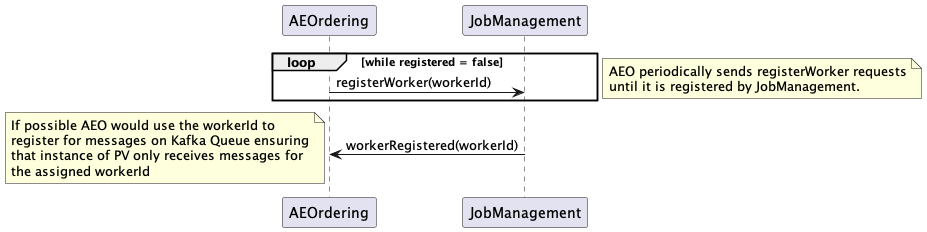
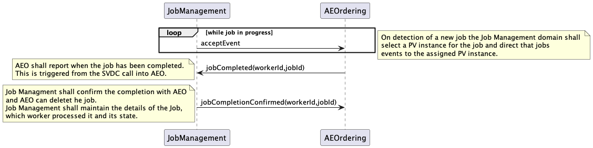
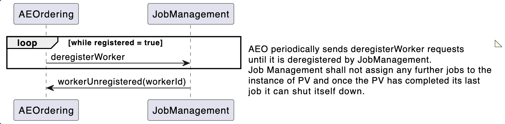

= Munin Horizontal Scaling Design

xtUML Project Analysis Note

== 1 Abstract

This note identifies the design for adding in a Job Management domain to aid 
in the solution for horizontal scaling.

== 2 Introduction and Background

The current MUNIN solution allows us to scale and meet the current requirement 
for scaling but is limited in that it does not allow for dynamic scaling of MUNIN.

This design note sets out that can be achieved and introduces a new domain 
Job Management that shall be used to manage the assignment of jobs to PV workers.

== 3 Design

If we want to increase the number of PV procesess in the current design to manage 
the allocated lanes it is necessary to stop the running system and reconfigure to
define new instances of PV and there assigned lanes.

This solution makes use of the worker pattern allowing PV instances to be started 
without the use of fixed lanes. Jobs shall be assigned by the Job Management domain 
to PV workers using a round robin technique.

Each PV worker will have to maintain a heartebat with Job Management and loss of
the heartbeat will cause the worker to be retired. Any in progress jobs assigned to
a PV worker who has retired shall become unassigned and added to the queue of jobs
that need processing.

The current thinking is that Job Management will be deployed with Reception as single 
instance of the Reception domain has been performant in recent bench testing. Therefore 
a PV worker shall be made up of AEO and SVDC. 

=== 3.1 Register Worker

When a PV worker instance is started it shall assign itself a workerId by generating
a UUID.

It shall then periodically send out the registerWorker message to Job Management.

When Job Management recives the request to register from the PV instance it shall be 
added to the pool of employed PV Worker instances that are employed by Job Management.

If Job Management thinks that the PV worker is already registered then the request 
shall be acknowledge as it it was not registered. QUESTION: What should it do with 
any assigned jobs under this condition?

If Job Management thinks that the PV worker is retired it shall migrate it back to 
employed.

.Register Worker

=== 3.2 Worker Heartbeat

The PV worker shall periodically send a heartbeat to Job Management to indicate that 
it is still operating.

Job Management shall be configured with a timeout that indicates the frequency that
this heartbeat should be recieved for each PV worker. Whne the heartbeat is note 
received in this period a counter is incremented and checked against a configurable
threshold. If the threshold is breached then the PV worker is considered to be retired.

If a PV worker is retired while it has in progress assigned jobs in Job Management the jobs 
shall be moved to unassigned and place back in the queue of jobs to be processed.

.Woker Heartbeat
image::WorkerHeartbeat.png[Worker Heartbeat]

=== 3.3 Job Assignment

Once Reception has validated that the provided event against the schema rather than calling 
AEOrdering interface acceptEvent it shall call the JOb Management interface acceptEvent.

Job Managment shall check for a job already existing for this event and if not create a new
unassigned job and attempt to allocate it to the next available PV workers based on the round
robin queue that is being employed. Once assigned the event shall be passed to the PV worker.

Job Managment shall have a maximum number of jobs per PV worker and if they are all maxed out 
then the job shall remain unassigned.

If an event is received for an existing Job that is already assigned it shall be passed to the
PV worker.

If an event is recieved fro an unassigned job it shall be stored until that job can be assigned.

Once the PV worker has completed the job it shall report back to job management indicating if it 
passed or failed. Passed jobs shall be deleted immediately. Failed jobs have a deletion timer that
during testing shall allow for further inspection.

.Job Assignment

=== 3.4 Deregister Worker

It is possible for the PV worker to ask to be deregistered. If this happens any assigend jobs that
are in progress are moved to unassigned and placed at the back of the queue to be re-assigned. the 
PV worker is removed to retired and will eventually be deleted from Job Management.

.Deregister Worker

=== 3.6 Job Management Domain

As can be seen from the class diagram the only class with any state behaviour os the Employed worker and that is there to manage the heartbeat from the PV workers.

As all job assignemts are not controlled by Job Management if thsi process is made persostent then there is no requirement for a Job ID Store further reducing reliance on file I/O.

.Job Management Class Diagram

== 4 Work Required

=== 5.1 Job Management

. Finish implementation of Job Management
. Create a deployment process containing Job Management and Reception

=== 5.2 AEOrdering

. Remove laneing from AEOrdering
. Add the concept of a worker to AEOrdering to generate the worker id, register with Job Management, 
deregister with Job Management and maintain the heartbeat with Job Management
. Update the PV_PROC process to interact with Job Management
. Remove Job ID Store.

=== 5.3 PV_PROC and Kafka Deployment

. Update the PV_PROC docker compose to be just one instance and use the docker replica feature.
. Updte the kafka docker compose for the new messages.

=== 5.4 Kubernetes

To reach full horizontal scaling some research should be carried out into how we can scale the PV_PROC worker instances unsing Kubernetes.

