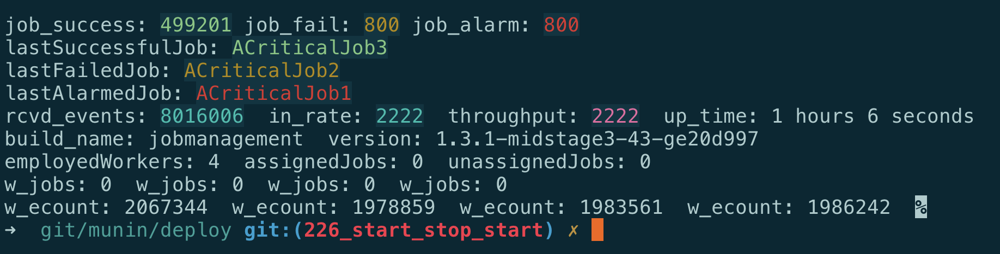

= Munin 1.4.0 Release Notes

== 1 Summary

The Munin Protocol Verifier gained features and stability through Phase 2
Stage 5.  As the Protocol Verifier readies for production deployment, a
focus was made on deployment use cases, namely logging, reporting and
continuous operation.  Logging and Reporting were a key focus with
entirely new architectural infrastructure added to provide functionality
and configurability.  An operations dashboard was constructed, refined and
then used during testing.  Operational use cases such as starting,
stopping, restarting and reconfiguring were practiced.  As in previous
stages, collaboration was high among target users, testers and development
engineering.

As compared to the 1.3.0 release, the 1.4.0 release exhibits a reduction
in throughput on the independent test fixture.  This is being analysed.
More is explained in the 'Testing' section below.

=== 1.1 Highlights

Here is a list of areas improved in this release cycle.  More detail
follows.

Logging::
The information and collection methods of logging are made richer and more
flexible.

Reporting::
The collection, filtering and presentation of failures, alarms, throughput
and other statistics has been implemented.

json2plus::
We already had 'plus2json', now we go the other way and derive PLUS
(PlantUML .puml) from (reverse engineered) JSON job definitions.

Hashing of Invariants::
Invariants are no longer persisted as cleartext but are hashed.

Throttling::
The Protocol Verifier can now regulate its throughput and avoid overrun
conditions.

Start/Stop/Start::
The Protocol Verifier can now start, stop and start again, picking up
from where it left off.

Testing and Bug Fixing::
Any time we test, bugs are identified and addressed.

== 2 Improvements

=== 2.1 Logging

The logging infrastructure migrated from `Poco` to a more functional and
more widely used framework called `log4cplus`.  The primary motivation
centered around the need to log through `Kafka`.  However `log4cplus`
brings a host of additional features and functionality.  Highly useful in
the Protocol Verifier is the ability to enable and disable various logging
channels through configuration:

* Logging can be configured to append to files, Kafka topics and/or syslogd.
* The benchmark probe is now switchable.  It can be enabled and disabled
  through configuration.
* The PV Prime capability also can be switched on and off as needed
  without changes to code or build environment.  (Note that a PV Prime
  instance must be separate from the PV under observation.)
* Logger categories are established for logging information,
  warnings and alarms for the __system under observation__.
* Debug and engineering logging categories are established with a
  fine-grained set of switches.  This enables non-invasive debug logging
  even in production environments.
* Log messages are now standardised as JSON objects opening a wide range
  of possibilities for the reporting back end.  JSON is the most supported
  format for reporting and filtering and monitoring systems.

The content and frequency of log messages were carefully analysed.  The
reporting of good behaviour has been reduced; the reporting of bad
behaviour is now more detailed.  Successful jobs have short log messages
carrying the name and identifier of the successful job.  Failed and
alarmed jobs carry a high level of detail tracing each event in the failed
job as well as the type of constraint that triggered the failure.  These
failure logs are reported in _canonical_ fashion keeping all of the
relevant information together for ease of follow-up analysis.

The requirements analysis for Logging can be found in <<dr-2>>.

=== 2.2 Reporting

Going hand-in-hand with Logging, Reporting has been analysed and then
implemented on the basis of the analysis.  Requirements were derived from
usage of the Protocol Verifier during testing and through interviews with
stakeholders.  Reporting is supplied through Kafka topics and can flow
into standard back-end monitoring systems like Apache NiFi.

A simple yet useful text-based dashboard has been implemented to
demonstrate presentation of the reporting output.

Reporting is divided into two categories.  The first is reporting the
status of the __system under observation__.  The second is reporting the
status and health of the running Protocol Verifier itself.

==== 2.2.1 System Under Observation

The first mission of the Protocol Verifier is to report failures and alarm
conditions by detecting protocol violations in the __system under observation__.
Following are some of the reports which are possible:

* successful/failed/alarmed job names
* successful/failed/alarmed job counts

==== 2.2.2 Protocol Verifier Health Statistics

For operational purposes several statistics are useful in monitoring the
status and health of the Protocol Verifier.  Following are some of the
reports which are available:

* uptime
* total number of events processed
* throughput (in audit events per second)
* job count by worker
* event count by worker
* version and build ID of the running PV

The requirements analysis for Reporting can be found in <<dr-3>>.

=== 2.3 `json2plus`

As part of a reverse engineering exercise meant to derive job definitions
from runtime audit event streams, a new utility was born.  The reverse
engineering tooling was able to derive the job definitions as JSON data
objects.  `plus2json` was extended to take the JSON data object job
definitions and produce the textual PLUS (PlantUML .puml) files.

=== 2.4 Hashing of Invariants

Extra-job invariants get persisted so that they can be loaded by jobs
which refer to them.  The Protocol Verifier had been persisting these into
a real-time database in the form in which they were received.  To reduce
the attack surface of the Protocol Verifier, now a hash of the invariant
is persisted and calculated in the comparison.  The as-received cleartext
(which may actually already be a hash or encrypted value) is never
persisted without a one-way transformation.

=== 2.5 Throttling

The Protocol Verifier can now regulate its throughput and avoid overrun
conditions.

As posted in the xtUML Community Chat:

"Scenario: Your application receives input from a persistent message
broker like Kafka. The broker has been storing messages for you while you
sleep (or have not started yet). Suddenly, you wake up to 1 million
messages. Can you handle them gracefully?"

We could not. Now we can. <<dr-4>> describes what we did.

=== 2.6 Start/Stop/Start

The Protocol Verifier can now start, stop and start again, picking up from
where it left off.  This is accomplished by interacting with the Kafka
message broker in a way that keeps track of which messages have been
delivered and which have not.  It is noted that if the Protocol Verifier
is terminated with some jobs "in-flight" (some events processed and some
still undelivered), these (few) jobs will fail.

== 3 Test

Testing was (again) continuous during the release cycle.  The development
team together with an independent test team and a user team focused
functional and performance testing on the Protocol Verifier.  Stress
testing, endurance testing and benchmarking got the most attention getting
hours and days of non-stop running logged.  As functionality was added or
changed, tests would be re-run to avoid functional regression and to
maintain throughput.

In a midstage release, a performance degradation was noted by the
independent testing team.  Performance remained above the specified
requirement but was substantially less than achieved in the 1.3.0 release.
The causes of the reduction are under investigation.  The first step has
been to erect a shared testing space so that test engineers and
development engineers can work in the same space.  More will be reported
in the upcoming stage.

== 4 Document References

. [[dr-1]] https://github.com/xtuml/munin/releases/tag/v1.4.0[Munin Phase 2 Stage 5 release tag]
. [[dr-2]] https://github.com/xtuml/munin/blob/main/doc/notes/188_enhance_logging_ant.adoc[Munin Logging Analysis]
. [[dr-3]] https://github.com/xtuml/munin/blob/main/doc/notes/189_reporting_ant.adoc[Munin Reporting Analysis]
. [[dr-4]] https://github.com/xtuml/munin/blob/main/doc/notes/219_overrun_ant.adoc[Throttling and Overrun Protection]
